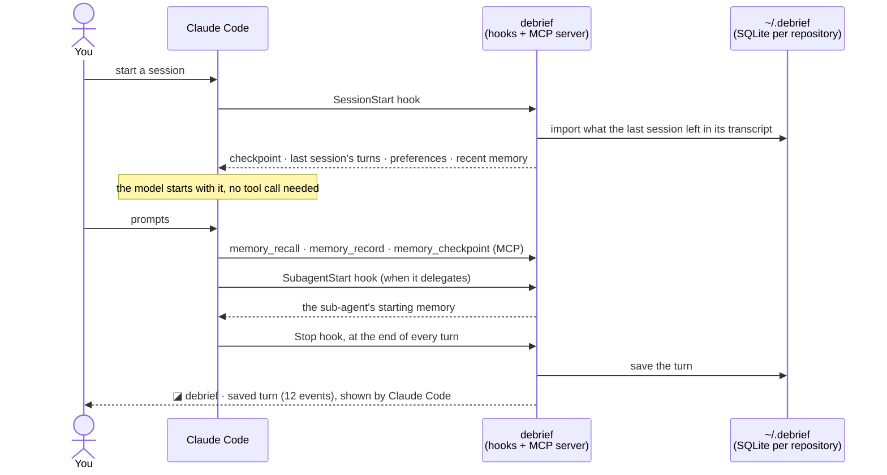

# Debrief

[](https://www.npmjs.com/package/debrief-cli) [](LICENSE)

**Working memory for Claude Code that stays on your machine.** When a session ends, even when it is killed mid-turn, the next one starts already knowing where things stand: the goal, what was tried, what was decided, what comes next. Sub-agents start with the checkpoint and recent memory too, and what they find is remembered.

How it differs from hosted memory plugins:

| | What it means | How it is checked |
|---|---|---|
| **Local, no network** | memory is SQLite files in `~/.debrief`; Debrief never opens a connection | its driven tests run every Debrief process under a guard that refuses and logs any connection; the logs stay empty |
| **Cited** | every memory records where it came from: a transcript passage, a command's output, the agent's inference, your direction | every recalled item carries its attribution and source (host, session, transcript); copies of one observation never count as corroboration |
| **Flags stale memory** | memory pointing at code that has changed since is marked stale, and the agent is told to read the file again | freshness is checked against the file itself (its hash) at every recall and read |

Debrief stores knowledge *about* the work, never the code or documents themselves. The repository stays the source of truth.

## How it works



- **Killed or crashed sessions are not lost.** A turn the Stop hook never saw is read from Claude Code's transcript at the next session start and given to the agent as "Last session … without a checkpoint".
- **The agent keeps it current.** After several turns of work with no checkpoint, Debrief asks the agent once, at the end of a turn, to save one.
- **Scope follows Git.** Memory belongs to the repository (and the worktree's line of work) you are in; one repository's memory never shows up in another.

## Install

```sh
npm install -g debrief-cli
```

Then, in Claude Code:

```text
/plugin marketplace add 0xAysh/debrief
/plugin install debrief@debrief
```

This registers Debrief's MCP server and its five hooks, with nothing else to edit. Start a new session.

## The first session: importing past sessions

The first session asks, once, whether Debrief may seed memory from Claude Code's local transcripts of past sessions:

| Answer | Imports |
|---|---|
| `all` | every project's transcripts, each into its own repository's memory |
| `current_project` | only this repository's |
| `none` | nothing: Debrief remembers from now on |

Answer in the chat, or from a terminal with `debrief import --set all|current_project|none`. Imported passages are bounded, attributed and cited back to their transcript. Hidden reasoning, binaries, recognised secrets, the contents of sensitive files (`.env`, keys, credentials) and Debrief's own output are left out.

## What the `◪ debrief` notices mean

Claude Code shows them to you; they are never sent to the model.

| Notice | Meaning |
|---|---|
| `checkpoint r3 loaded · 2 preferences · 8 items` | Session start: what the agent was given before your first prompt. |
| `no memory yet` | Nothing stored for this repository yet. |
| `last session ended without a checkpoint (claude-code)` | The last session stopped, or crashed, before saving where it stood. Its last turns were read from its transcript and given to the agent. |
| `turns after r3 included` | Work happened after the last checkpoint. Those turns were given to the agent too. |
| `transcript import needs your answer` | The import question above is still open. |
| `workstream to confirm` | Debrief cannot tell which line of work this session continues, so the agent will ask you. |
| `saved turn (12 events)` | The turn that just ended was saved. |
| `recalling: retry budget` | The agent searched memory. |
| `⚠ turn not saved (…)` or `⚠ 2 hook failures (…)` | Something failed. Run `debrief diag status`. The session itself carries on: a failing hook never interrupts it. |
| `not running: the debrief command is not on PATH` | The plugin is installed but the command is not: `npm install -g debrief-cli`. |

## Commands

| Command | What it does |
|---|---|
| `debrief status` | Is it working here? Checks the plugin, the MCP handshake, each hook's last run, the last capture and the import choice; exit 1 on a problem. **The first thing to run when something seems off.** |
| `debrief import [--set all\|current_project\|none]` | Shows the import question, or records your answer and imports to completion. |
| `debrief report [--since 7d] [--all]` | Did Debrief help? Searches per session, which returned records the agent went on to use, which turned out wrong, how fresh they were, what it cost. This repository by default; `--all` for every one. Offline, from this machine's data only. It never estimates tokens "saved". |
| `debrief report --review` | Rate up to 10 random searches from the window: good, partial or missed something, with an optional note. The next report shows your ratings. |
| `debrief delete-data [--yes]` | Deletes all stored memory after you type `delete` (see below). |

The `debrief diag …` commands and `debrief mcp` are for diagnostics and for the host: see [docs/development.md](docs/development.md#commands).

## Keeping things out of memory

| You want | Do |
|---|---|
| a passage never stored | wrap it in `<private>…</private>` in your prompt |
| a whole session forgotten | tell the agent **"don't remember this session"**: Debrief forgets what the session stored (in a resumed conversation, what its earlier sessions stored too), never imports its transcript, and refuses its later writes |
| a wrong memory fixed | say so ("that's wrong", "that changed"); the agent is instructed to correct or retract it with `memory_manage` |

Claude Code's own transcript files still hold the conversation: that is Claude Code's data, not Debrief's.

## Uninstall, and deleting your data

Uninstalling and deleting data are separate steps, so removing Debrief never deletes memory by accident.

```text
1. debrief delete-data                  optional, and first: it needs the debrief command
2. /plugin uninstall debrief@debrief    in Claude Code
3. npm uninstall -g debrief-cli
```

`debrief delete-data` shows the path, size and number of repositories, and deletes only after you type `delete` (`--yes` skips the question, and is required when there is no terminal). Close Claude Code sessions first, since a running session keeps writing. It removes only the files Debrief created: anything else in `$DEBRIEF_HOME` is left alone.

Without `delete-data`, your memory stays in `~/.debrief`.

## Supported versions

| | Supported | Tested with |
|---|---|---|
| Node.js | `>=24` | 25.9.0 |
| better-sqlite3 | `13.0.3` (installed with the package) | 13.0.3 |
| Claude Code | `2.1.284` | 2.1.284 |

Tested on macOS (arm64). Other platforms and other Claude Code versions are untested: `debrief status` is the first check there.

## Known limits

- **Claude Code on your machine only.** Codex can be connected by hand ([docs/hosts.md](docs/hosts.md)); its hooks, and Pi, are not packaged yet. Cloud agents and sandboxes (Claude Code on the web, remote sandboxes) are not supported: memory lives on the machine that runs `debrief`.
- **A step killed within about 0.1 s is lost.** Claude Code writes each step to its transcript a moment after taking it (measured on 2.1.283); a session killed inside that moment loses that step.
- **Memory is not ground truth.** It is what agents observed and concluded. Freshness warnings cover code that has changed; issues, PRs and other external state are not checked.

## Documentation

| Doc | For |
|---|---|
| [docs/architecture.md](docs/architecture.md) | how it works inside: the memory module, scope, storage, import, lifecycle, hooks |
| [docs/hosts.md](docs/hosts.md) | connecting hosts by hand (Codex, Claude Code without the plugin) and each host's caveats |
| [docs/development.md](docs/development.md) | building, testing, the test seams, benchmarks, every command |
| [CHANGELOG.md](CHANGELOG.md) | releases |

MIT licensed.
