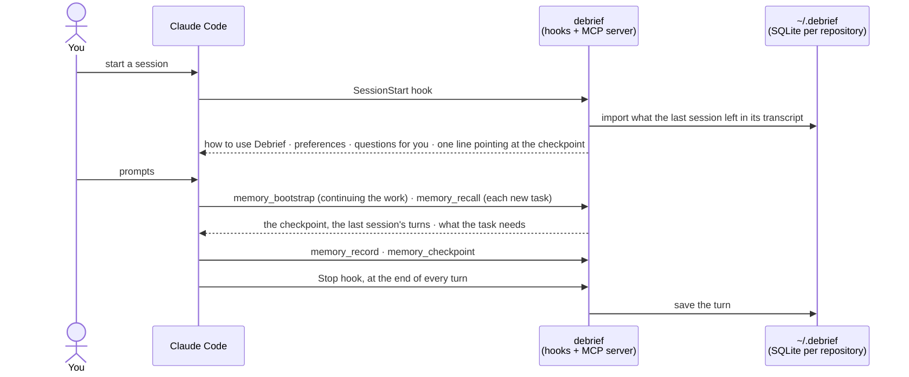

# Debrief

[](https://www.npmjs.com/package/debrief-cli) [](LICENSE)

Working memory for Claude Code that stays on your machine.

When a session ends, even if it was killed mid-turn, the next one knows where things stand: the goal, what was tried, what was decided and what comes next. The agent searches memory at the start of each task. Memory that points at code is checked against the file, so the agent is told when it is stale.

> **Status:** paused. This is a portfolio project and it is not actively developed.

## Try it

You need Node.js 24 or newer and Claude Code.

```sh
npm install -g debrief-cli
```

Then, in Claude Code:

```text
/plugin marketplace add 0xAysh/debrief
/plugin install debrief@debrief
```

Start a new session and check that everything is wired up:

```sh
debrief status
```

The first session asks once whether Debrief may import your past Claude Code sessions. Answer `all`, `current_project` or `none` in the chat, or run `debrief import --set none` in a terminal.

A two-minute test:

1. Start a session in a Git repository and give it a small task.
2. Kill Claude Code in the middle of a turn.
3. Start a new session and ask it to continue. It gets the last session's turns from memory, with no handoff from you.
4. Run `debrief report` to see what the agent searched and what it used.

The notices, commands, privacy controls and the opt-in meaning search are in [docs/usage.md](docs/usage.md).

## How it works



- The Stop hook saves every turn. If a session was killed before its last turn was saved, the next start reads that turn back from Claude Code's transcript.
- Session start is about 600 tokens plus your preferences, and it does not grow with memory. Task context comes later, when the agent searches.
- Every memory says where it came from: a transcript passage, a command's output, the agent's inference or your direction.
- Memory that cites code keeps a fingerprint of what it cites. Each recall checks that against the file, and an edit there marks the memory `stale`.
- Memory is SQLite files in `~/.debrief`. Debrief never opens a network connection.

## Benchmarks

Everything ran on an Apple M4 Pro (macOS, Node 25.9). The benchmark harnesses and data are not in this repository. The method, the full tables and the negative results are in [docs/benchmarks.md](docs/benchmarks.md).

| What | Result |
|---|---|
| [LongMemEval_S](https://github.com/xiaowu0162/LongMemEval) retrieval, 419 scored questions, session recall@5 | 94.3 with keyword search. A correctly tokenized BM25 gets 94.7, so this is BM25 level |
| Same, with meaning search on | 97.6 |
| 30 hand-written questions over code memory, right answer ranked first | 15 of 30 with keyword search, 21 with meaning search |
| Real Claude (Opus), code questions that share no words with their answer, prompt ending "Check memory.", 30 runs | 30/30 with keyword search only, 30/30 with meaning search |
| Real Claude, bare questions with no "check memory" hint, 24 runs | 12/24. Every miss was a run that never searched memory |
| Real Claude, compact index then read vs full memory packs, 3 runs each | correct 3/3 with 2,905 recall tokens vs partial 3/3 with 6,343 |
| Session start with a full checkpoint and 60 notes | 1,406 → 651 tokens |
| Meaning-search model process, resident memory while loaded | about 660 MB in the first spike → 213 MB shipped |

Two of these results changed the product.

The agent writes its own search queries, and its first query already contained the answer's words. So meaning search added nothing on code memory, and I made it opt-in. The real failure is the agent not searching at all when a question sounds general.

## What I built

- A memory store on SQLite with versioned migrations. Memory is scoped by Git repository and worktree, and records have a lifecycle: superseded, retracted, forgotten, private sessions.
- Capture from Claude Code's own transcripts. A killed session loses only a step taken in its last 0.1 s or so, before Claude Code wrote it to the transcript.
- Freshness checks on code references. A memory stays `current` when lines above the cited code move, and turns `stale` when the cited lines change. File reads imported from old transcripts are fingerprinted too.
- Hybrid recall: BM25 with tiers for exact phrases, code identifiers, time words and trust, plus optional int8 embeddings fused by reciprocal rank fusion. The model ships inside the npm package and runs in a separate process that exits after two idle minutes.
- `debrief report`: a local call log that shows what the agent searched, what came back and what it used.
- Tests that drive the real Claude Code binary against a local stub model, with a guard that refuses and logs any connection a Debrief process opens. The logs must stay empty. CI runs on Linux, macOS and Windows.

## Limits

- Claude Code on your machine only. Cloud agents and remote sandboxes are not supported. Codex can be connected by hand ([docs/hosts.md](docs/hosts.md)).
- The tests that drive real Claude Code have only run on macOS arm64. CI runs the rest of the suite on Linux and Windows too.
- Memory is not ground truth. Freshness checks cover code; issues, PRs and other outside state are not checked.
- Meaning search is off by default. When on, its model process holds about 215 MB while loaded.

| | Supported | Tested with |
|---|---|---|
| Node.js | `>=24` | 25.9.0 |
| better-sqlite3 | `13.0.3` (installed with the package) | 13.0.3 |
| Claude Code | `2.1.284` | 2.1.284 |

## Uninstall

```text
debrief delete-data                  optional, and first: deletes ~/.debrief after you type "delete"
/plugin uninstall debrief@debrief    in Claude Code
npm uninstall -g debrief-cli
```

## Docs

| Doc | For |
|---|---|
| [docs/usage.md](docs/usage.md) | notices, commands, privacy controls, meaning search |
| [docs/benchmarks.md](docs/benchmarks.md) | how each number above was measured |
| [docs/architecture.md](docs/architecture.md) | how it works inside: the memory module, scope, storage, import, lifecycle, hooks |
| [docs/hosts.md](docs/hosts.md) | connecting hosts by hand (Codex, Claude Code without the plugin) |
| [docs/development.md](docs/development.md) | building, testing, the test seams, every command |
| [docs/adr/0001-meaning-search.md](docs/adr/0001-meaning-search.md) | the meaning-search decision record, with every measurement |
| [CHANGELOG.md](CHANGELOG.md) | releases |

MIT licensed.
