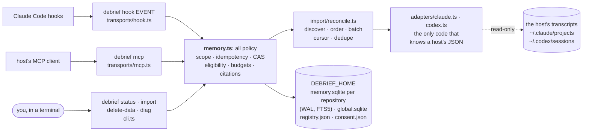
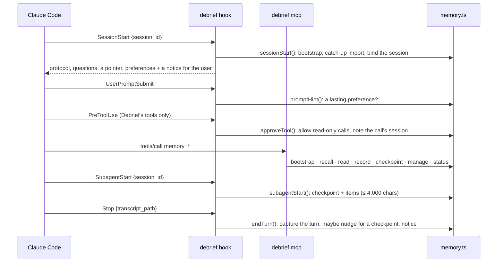

# Architecture

How Debrief works inside. For using it, see [usage.md](usage.md); for connecting hosts by hand, [hosts.md](hosts.md); for building and testing, [development.md](development.md).

## At a glance



Transports parse and print; the memory module decides. Processes never talk to each other: they meet only in `$DEBRIEF_HOME`, in the SQLite files (through WAL) and a few small JSON files (hook runs and failures, which session made a tool call).

One Claude Code session, as the hooks and the MCP server see it:



| Section | Covers |
|---|---|
| [Memory module interface](#memory-module-interface) | every method and its contract |
| [Scope](#scope) | repository → workspace, worktree → workstream, ambiguity |
| [Storage and invariants](#storage-and-invariants) | tables, eligibility, what reads what |
| [Transaction ordering](#transaction-ordering) | writes, reads, ranking, budgets, continuations, compact recall, timelines, durability |
| [Recall applicability](#recall-applicability) | freshness, test results, independent roots |
| [Transcript import](#transcript-import) | consent, adapters, Claude Code and Codex formats, privacy, batches, scope |
| [Memory lifecycle](#memory-lifecycle) | correct, supersede, retract, restore, forget; taints; the ledger |
| [Preferences](#preferences) | questions, answers, where a preference applies |
| [Private sessions](#private-sessions) | "don't remember this session" |
| [Handoff](#handoff) | Claude → Codex → Claude through one database |
| [Host hooks](#host-hooks) | the hook transport, the plugin, `debrief status`, `delete-data` |
| [Runtime gate](#runtime-gate) · [Error codes](#error-codes) · [Migrations](#migrations) | |

The adapters contain no memory policy. Host differences outside the transcript format live in one descriptor table, `src/hosts.ts`: `openMemory` picks the transcript adapter from it (`claude-code` → Claude Code, `codex` → Codex, anything else → none), the MCP server the `_meta` key that names a live session (Codex: `threadId`; an id longer than 200 characters is ignored, never cut), and the CLI its `--host` choices. The MCP server forwards raw tool arguments to the module. The module parses them with the zod schemas in `src/schemas.ts`, which are also the source of the tools' JSON Schemas. Each `DebriefError` becomes `isError: true` with `{ error: { code, message, retryable, details } }`.

## Memory module interface

`openMemory({ cwd, host, home?, hostSessionId?, busyTimeoutMs?, claudeConfigDir?, codexHome?, importBudgetMs? }): Memory`. All methods are synchronous and throw only `DebriefError` for expected failures.

| Method | Contract |
|---|---|
| `bootstrap({hostSessionId?, importChoice?, task?, workstream?, maxTokens?, maxBytes?})` | Binds scope (or returns `scope.ambiguity`), records an import choice if given, imports the current project's approved transcripts within `importBudgetMs` (default 3 s), and returns scope, `import` status (or the consent question), `recall({ maxTokens, maxBytes })`, the `preferences` block, and `lastSession`: the digest of the last session's turns no checkpoint covers (see [Host hooks](#host-hooks)), never the calling host session's own, else null. `workstream` (`<id>` or `"new"`) answers an ambiguity; `task` names the task explicitly |
| `captureTurn({transcriptPath, maxMs?})` | Imports the one transcript a host's Stop hook names, after consent and only if the path is one of the host's transcripts (`fileAt`) recorded in this repository. Binds no session; creates no database without consent. Records a hook failure for storage errors and unimportable paths; skips (no consent, another repository, not a repository) are not failures. See [Host hooks](#host-hooks) |
| `sessionStart({hostSessionId?})` | Bootstrap rendered as session-start text for a host hook (the protocol, questions for the user, one line pointing at work memory, preferences; never the work itself), plus a one-line notice for the user; null outside a Git worktree. Memory that cannot be read yields context saying so, never empty memory. See [Host hooks](#host-hooks) |
| `subagentStart({hostSessionId})` | What a sub-agent starts with: the head checkpoint, confirmed preferences and labelled items of the session that started it, within `SUBAGENT_CONTEXT_CHARS` (4,000). No protocol, no digest, no import, and nothing for the user (consent, a workstream to confirm, preference questions are neither shown nor marked asked). Null outside a Git worktree. See [Host hooks](#host-hooks) |
| `endTurn({transcriptPath, stopHookActive?, maxMs?})` | The Stop hook: `captureTurn`, then (unless `stopHookActive`) `nudge`, a request to update a checkpoint that fell five turns of work behind, and `notice`, the user's line: `saved turn (N events)`, or why the turn was not saved. See [Host hooks](#host-hooks) |
| `promptHint({prompt})` | One line for the agent when a prompt states a lasting preference; null otherwise and outside a Git worktree. No database |
| `approveTool({tool, input, call?: {toolUseId, hostSessionId}})` | `{notice}` when a call may skip the host's permission prompt (Debrief's read-only calls, by exact server name), else null. For any Debrief call with both ids, notes which session made it for the MCP server (`$DEBRIEF_HOME/tool-sessions.jsonl`). No database |
| `continueImport({maxMs?})` | One bounded step of the remaining approved import (current project first, then other projects' own workspaces). The MCP server calls it between requests while alive. Not an agent tool |
| `record({kind, body, attribution, …})` | Appends one record with its links and search chunks; `operationKey` makes it idempotent. `kind: "preference"` stores nothing: it returns a question for the user (see [Preferences](#preferences)) |
| `settlePreference({candidateId, outcome})` | What happened when a preference question was put to the user directly: their answer, `cancelled`, or `unavailable`. Transports call it; it is not an agent tool |
| `checkpoint({expectedRevision, goal, status, …})` | Appends revision `expectedRevision + 1` only if the head still equals `expectedRevision` |
| `recall({query?, kinds?, maxTokens?, maxBytes?, continuation?, mode?})` | A bounded pack: head checkpoint first, then ranked eligible items (see [Ranking](#transaction-ordering)), each with a `why` when more than keyword relevance placed it, live freshness, provenance, independent root and corroboration (see [Recall applicability](#recall-applicability)), plus `corrections` when memory in scope changed since this session's previous pack. `mode: "compact"` returns the same pack with each entry as one index line (see [Transaction ordering](#transaction-ordering)) |
| `read({recordId, maxTokens?, maxBytes?, offset?, around?})` | A slice of one visible record's body, with its visible links, live freshness and independent root. Offsets count UTF-16 code units; an offset inside a surrogate pair snaps back to that code point's start. A record that is no longer current is `not_found` with its `lifecycle`, `replacementId` or `taint`. `around: N` (1–10) adds a `timeline`: up to N records of its session on each side, as index lines (see [Transaction ordering](#transaction-ordering)) |
| `manage({v?, action, recordId?, recordIds?, confirmToken?, body?, reason?, attribution?, operationKey?})` | `inspect` \| `correct` \| `supersede` \| `retract` \| `restore` one in-scope claim, or `forget_preview` then `forget` (see [Memory lifecycle](#memory-lifecycle)). Each change is one transaction; the result lists what it took out of (or back into) current guidance |
| `status()` | Runtime, storage, recent `hookFailures`, the scope bootstrap *would* resolve (`workstreamId`, `resolvedBy`, `taskKey`, or the `ambiguity` it would ask), and counts. It runs the same resolution rules as bootstrap without their writes (`previewWorkstream`); after a repository move it reports no resolution until bootstrap re-points the bindings, and none while a schema migration is pending (the next bootstrap migrates). Strictly read-only: no registry entry, rows or migrations. Never throws for scope or storage problems |
| `rebuildSearchIndex()` | Regenerates the derived index inside one write transaction |
| `checkIntegrity()` | Read-only `integrity_check`, `foreign_key_check` and FTS index-vs-content check. It reports a damaged, foreign or unmigrated file and never repairs or migrates it |

## Scope

Scope is resolved from the trusted `cwd` on the first operation. Payload schemas are strict, so `workspaceId`, `workstreamId`, `cwd` and `path` are rejected. The one scope input is bootstrap's `workstream`, the user's answer to an ambiguity. It can only name a workstream in the database already chosen from `cwd`, so an id from another workspace is `not_found` and can never widen scope.

**Workspace = repository identity** (`src/bootstrap/workspace-resolution.ts`). `locateWorkspace` reads Git and the registry and writes nothing. `registerWorkspace` records the result.

| Signal | Weight | Why |
|---|---|---|
| Repository key: realpath of the Git common dir | Authoritative while the repository stays put | Every worktree of one repository shares it, and unrelated repositories never do, however similar their names. The workspace id is `ws_` + its hash, salted only if the registry already gives that id to another workspace |
| Recorded root commit absent from this object store | Proves "different repository" | A path reused by an unrelated repository must not inherit memory. The old entry is retired, and the newcomer gets its own id |
| Unregistered key, old key gone from disk, recorded root commit present here, exactly one such workspace | A move | The registry entry and the database's `repository_key` are re-pointed. Worktree bindings under the old main worktree are rewritten to the same relative position, and linked worktrees outside it keep their paths. Consent for the old path still applies |
| Root commit alone | Evidence, never identity | Clones and forks share it. A clone whose original still exists stays separate. Two vanished candidates are never guessed between. An unborn repository never matches |

Known limit: a fresh clone made after the original was deleted is indistinguishable from a move, because Debrief keeps no marker inside the repository. It continues the original's memory. A linked worktree moved with `git worktree move` loses its binding, and its orphaned workstream is then offered as a branch candidate. Transcripts recorded at a moved repository's old path, and not imported before the move, count as `unassigned`, because their cwd no longer resolves through Git.

**Workstream: one deep operation.** `resolveWorkstream` (`src/bootstrap/workstream-resolution.ts`) is used by live bootstrap and by the transcript importer. It returns a bound workstream (created and bound if needed) or an explicit ambiguity, inside the caller's write transaction, so Claude, Codex and Pi cannot drift apart. The rules decide first and write second; `previewWorkstream` runs only the decision, which is how `status` reports what bootstrap would do on a read-only connection:

| # (PRD §9.2) | Signal | Effect | Why |
|---|---|---|---|
| – | Explicit choice: `workstream: <id> \| "new"` | Binds, and rebinds the worktree to it | The user answered the question |
| 1 | Session metadata: this host + host session id already bound in `sessions`, or an imported transcript's Debrief output reporting `scope.workstreamId` of an existing workstream | Binds. A session binding never rebinds another workstream's worktree; an unbound worktree adopts it | Debrief itself bound that very session. Nothing is closer evidence. Ids not in this database are ignored |
| 2 | Existing binding of this Git worktree | Binds, whatever branch is checked out | The worktree is where the work physically happens. Bindings survive branch switches |
| 3 | Explicit task (`task` → task key: `#20`; `host/owner/repo#20` for an issue or PR URL; `PROJ-7`) | Binds the one active workstream with that key. A workstream without a key adopts it | The user named the task. A task that *contradicts* the task of the bound workstream from steps 1–2 is a conflict and is asked about, never overridden |
| 4 | Strong match to one active workstream | – | V1 has no strong signal beyond 1–3. Branch similarity is not one. An issue reference on a checkpoint is a citation, not an identity claim, so it sets no task key |
| 5 | Branch | Labels new workstreams. Lists active workstreams last seen on this branch whose every bound worktree is gone as candidates. Never binds | Branches are renamed, reused and shared by unrelated work. A workstream bound to a live worktree is never offered to another. A detached HEAD is no evidence |
| 6 | Conversational choice | More than one credible candidate, conflicting signals, or branch-only evidence: `scope.ambiguity`, nothing bound | Guessing would silently merge unrelated work |

One confident candidate binds automatically. With no candidate at all, the worktree gets a new workstream.

**Ambiguity UX.** `scope.ambiguity = { question, candidates, omittedCandidates }`. Each candidate carries `workstreamId`, `label`, `branch`, `taskKey`, `headRevision`, `lastCheckpoint` (goal, status and first next step, clipped; a field is null when the body is not in the rendered checkpoint form), `lastActiveAt` and `reasons` (`session_binding` / `worktree_binding` / `task` / `branch`, with a sentence). At most 5 are listed, the most recently active first. While ambiguous:

- the session row has `workstream_id NULL` (workspace-level);
- `recall` and `read` see only workspace-level records, because eligibility binds a key no workstream has, and the pack notice says why;
- `record` without `workspaceLevel: true` and `checkpoint` throw `scope_ambiguous`.

The agent shows `question`, then calls `bootstrap({workstream})`. That choice becomes the session's workstream and the worktree's binding. Bootstrap re-resolves an existing session only while it is ambiguous or when given `workstream` or `task`.

`ensureWorkspace` still fails closed with `storage_unavailable` when the database's `workspaces` row names a different workspace id or repository key that is not a recorded former key. An example is a registry entry pointing at another repository's database.

## Storage and invariants

`$DEBRIEF_HOME/registry.json` (atomic tmp+rename) maps each repository key to a workspace (id, label, root commit, former keys after moves). A `retired` section keeps workspaces whose path now holds another repository, so the moved original can reclaim them. Each workspace has `workspaces/<id>/memory.sqlite` and `config.json`.

| Table | Role | Invariant |
|---|---|---|
| `records` | Canonical, append-only knowledge | Body ≤ 16 KiB; `attribution`, `review_state`, `lifecycle` (v5) and `freshness` are CHECKed enums; `workstream_id NULL` means workspace-level; `superseded_by` names the replacement of a corrected or superseded claim |
| `links` | Provenance (`supported_by`, `derived_from`, `supersedes`, …) | Both ends visible to the writer's workstream at write time (the importer's lineage links need only be in scope) |
| `taints` (v5) | Why an active record is not current: (record, cause, `invalidated` \| `quarantined`) | One row per cause; the record is eligible again only when every cause is gone |
| `lifecycle_events` (v5) | Append-only audit of every lifecycle change | `seq` is the correction watermark |
| `suppressions` (v5) | Host events (host + event id) whose claim is no longer active | The importer skips new copies and versions of them. No foreign keys: markers outlive the rows they name |
| `workstreams` | Label, lifecycle, `head_revision`, `task_key`, `branch` (v4) | The head only moves inside the CAS transaction; `branch` (last seen) is evidence, never identity |
| `checkpoints` | Revision history | `PRIMARY KEY (workstream_id, revision)` backs the CAS |
| `operations` | Idempotency keys | The hash covers operation + workstream + normalised input |
| `worktree_bindings`, `sessions` | Scope binding | One workstream per worktree path; `sessions.workstream_id NULL` (v4) = a workspace-level session awaiting a choice |
| `chunks`, `chunks_fts` | **Derived** search projection: chunk text, and (v7) `terms`, the words inside its camelCase identifiers, and (v10) `text_hash`, the SHA-256 of the text | A pure function of `records`; rebuildable |
| `chunk_vectors` (v10) | **Derived** vector projection for meaning search: one int8 vector and its scale per (model id, chunk text hash) | A pure function of chunk text and model: survives a reindex, shared by identical chunks, never read for another model; deleted with the last chunk that has its text |
| `vector_fill` (v10) | The fill lease: which server embeds this workspace's missing chunks (holder, pid, heartbeat) | One row at most; taken over when the holder's process is gone or its heartbeat is a minute old |
| `sources` | One row per imported transcript | `records.source_id` points here |
| `preference_candidates` (v6) | Preference questions the user has not answered | Never records: nothing here is recalled, read or injected |
| `transcript_sessions`, `private_transcripts` (v6) | Which sessions a transcript's Debrief output named; transcripts never imported again | No foreign keys: markers outlive what they name |
| `import_cursors` (v2) | Per-transcript reconciliation position | Advances only in the transaction that stores the batch's records; `anchor_hash` detects rewrites |
| `import_events` (v2) | Event identity → record | PK = host + transcript + branch + event id + content hash, so replay is a no-op and an edit is a new version |
| `consents` | Reserved | The import decision is host-level, so it lives in `$DEBRIEF_HOME/consent.json`, not in a workspace |
| `call_log` (v8) | One row per call served: each memory tool call and hook run but PreToolUse (see [The call log](#the-call-log)) | Ids, labels, sizes and times, never a record's body; forget and private sessions blank it |
| `call_reviews` (v9) | The user's rating of a search (`debrief report --review`): good / partial / missed, an optional note | Forget and private sessions blank the note with the search's query |

**Eligibility** (`src/retrieval/eligibility.ts`) is one definition: a record must be in this workstream or workspace-level, have `lifecycle = 'active'`, and have no `taints` row. It exists in exactly three forms, all in that file: `VISIBLE_SQL` (scope + state), `ELIGIBLE_STATE_SQL` (state only, for a query that already fixed scope) and `eligibilityOf(row)` (the row form, saying why not).

| Read path | Uses |
|---|---|
| Recall ranking and FTS (`rankSequence`), page loading (`loadCandidates`) | `RECALL_ELIGIBLE_SQL` = `VISIBLE_SQL` minus checkpoints |
| Direct read, link targets of new writes | `requireVisibleRecord` → `eligibilityOf` |
| Link and citation expansion (`linksOf`, `citationsFor`), independent roots | `VISIBLE_SQL` |
| Head checkpoint in packs | `eligibilityOf` (withheld with a notice) |
| Ambiguity candidates' checkpoint glimpse | `ELIGIBLE_STATE_SQL` |
| Inspect (`eligible` flags) | `ELIGIBLE_STATE_SQL`, `eligibilityOf` |
| Export: `debrief diag records` | pages through recall | Recall additionally excludes checkpoint records: the head is returned separately. `memory_manage inspect` is the one reader of ineligible records, and it labels them (`eligible: false`).

## Transaction ordering

Every write is one `BEGIN IMMEDIATE` transaction, so it never upgrades from reader to writer and cannot hit `SQLITE_BUSY_SNAPSHOT`. Helpers that rely on the caller's transaction assert `db.inTransaction`: `appendRecord`, `insertLinks`, `indexRecord`, `rebuildSearchIndex`, `publishCheckpoint`, and for lifecycle changes `changeClaim`, `restoreClaim`, `confirmForget`, `insertTaints`, `inheritTaints`, `quarantineLateSummary` and `appendLedger`. Inside the transaction:

- **`record`**: look up the operation key → insert the record → insert links (each target scope-checked) → insert chunks and FTS rows → insert the operation row.
- **`checkpoint`**: look up the operation key (a replay wins over a conflict) → compare the head with `expectedRevision` → append the checkpoint record, its links and chunks → insert the `checkpoints` row → conditionally update `head_revision`.
- **`manage`** (a change): look up the operation key → check the claim's state (else `lifecycle_conflict`; for forget, the preview's impact) → append the replacement with its `supersedes` link → find dependents → insert taints → (forget: remove the payload) → set the lifecycle of the claim and its copies → insert or release suppressions → append the `lifecycle_events` row → append the ledger entry.

**Reads.** Recall reads in one deferred transaction, so the head, candidates and citations share a snapshot. Scope and eligibility sit in the WHERE clause, ahead of bm25 ranking. Ties are broken by `created_at DESC, seq DESC`. Query words are individually quoted, so FTS syntax cannot be injected.

**Ranking** (`src/retrieval/query.ts`, `rankSequence`, `src/retrieval/trust.ts`) reads what a query asks for beyond its words, with fixed rules and no model, and applies it as tiers ahead of bm25; among records that answer about equally well, trust decides:

```text
query ─ parseQuery(query, now) ─┬─ words ───────── toFtsQuery ── chunks_fts MATCH (text, terms) ── bm25 per record
                                ├─ phrases ─┐
                                ├─ window ──┼─ ORDER BY  1. verbatim phrases contained (more first)
                                └─ now? ────┘            2. relevant AND created in the window
                                                         3. close, newest first    (a question about now)
                                                         4. bm25, created_at DESC, seq DESC  (the order before #52)
                                                               │
                              page 1 only ── orderByTrust:  4a. relevance band: greedy, a band ends where bm25
                                                                falls short of 90% of its first record's
                                                            4b. trust inside the band: freshness now, test-run
                                                                evidence, attribution, independent roots
                                                            4c. bm25, created_at DESC, seq DESC
relevant = bm25 within half of the best record's; close = within 90%
```

**Trust** reorders only records about equally relevant, so relevance still leads: a stale record that answers the question better still comes first, and one that is the only answer still comes back, labelled. Inside a band the first difference decides, in this order:

| Level | Order | Why |
|---|---|---|
| freshness now | `current` > `unknown` > `stale` | the record's live label (its references and its test run; an asserted run is never better than `unknown`) |
| test-run evidence | `captured` > no run > `asserted` | a run with no evidence claims a result nobody saw; a record with no run claims nothing to verify, so it sits between |
| attribution | `direct_observation` = `user_direction` > `agent_inference` | what was seen or said over what the agent concluded |
| corroboration | more independent roots first | roots of the same claim among the compared records; copies share their original's root and never count |

Freshness leads, so an asserted run at the current state (`unknown`) outranks a captured run against an older commit (`stale`). Trust applies only with a query: recall without one (the recent list, bootstrap, session start) and records the "now" tier ordered stay as they were. Freshness for it is checked once, on page 1: one `checkFreshness` over the head checkpoint and every record of a band of two or more, in rank order, within the usual bounds. A reference past them is `unknown` / `check_limit`, so an unchecked record sits between current and stale, never with the stale ones. Page 1's labels reuse that result; a packed record it did not reach (a band of one, or a reference past the bounds) gets its own check as before. Continuations keep page 1's order, and later pages label live. A record trust lifted over one bm25 had placed before it says what decided it, only the levels that did: `trusted: current`, `trusted: current, captured`, `trusted: not stale`, `trusted: observed`, `trusted: 2 roots`. With no trust differences nothing moves, so plain queries rank exactly as before.

| The query has | Example | Effect | `why` |
|---|---|---|---|
| a camelCase identifier | `rankSequence` | also searches its words (`rank`, `sequence`), which the `terms` column matches in records that only say `rankSequence`; lifts records containing it verbatim | `exact "rankSequence"` |
| snake_case, a path or file name | `rank_sequence`, `retrieval/freshness`, `freshness.ts` | unicode61 already splits these; lifts records containing it verbatim | `exact "freshness.ts"` |
| a quoted phrase | `"exponential backoff"` | lifts records containing it verbatim (ASCII case-folded, in the title, body or reference locators) | `exact "exponential backoff"` |
| a time | `yesterday`, `last week`, `in August`, `before 2026-09-01`, `since …`, `last 3 days` | a `created_at` window in local time relative to now; relevant records inside it come first, the rest still follow; a query that is only a time and question filler lists recent records | `created last week` |
| a question about now | `now`, `currently`, `latest`, `these days` | records about as relevant as the best (bm25 within 90%) newest first | `newest first: asks about now` |

A query with none of these runs the plain statement, so it ranks exactly as before unless trust tells equally relevant records apart. Two caveats. A plain word that also occurs inside an identifier (`index` in `rebuildSearchIndex`) now finds that record too, and records with identifiers are a little longer to bm25, so orders in such workspaces can shift slightly. Time is a boost, never a filter: a sense of when something happened is often a little off, and a filter would lose the answer. Recall's clock is `openMemory({ now })` (the system clock by default; tests set it, and `record` stamps with it too).

**Budgets.** The budget covers the whole pack as the client receives it: the UTF-8 length of its JSON, including `scope` (and any ambiguity question), omissions, notice, continuation and the `budget` object. `usedBytes` is that exact length, and the effective budget is `min(maxBytes, 4 × maxTokens)`. Tokens are estimated as `ceil(bytes / 4)`. The bootstrap pack is `recall({ maxTokens, maxBytes })` and has the same budget (2,000 tokens / 8,000 bytes by default; bootstrap accepts both, validated as for recall). The envelope is measured first; the continuation may take at most a quarter of the budget, and entries fill the rest (the entry that leads a page may use the continuation's share, which then carries less). Each entry is measured with its fixed metadata (warning, per-reference freshness, citations, provenance, copies) before its body, so under pressure the body is cut, and a cut body ends with an explicit `[… cut by Debrief …; memory_read …]` marker. Warnings and citations are never dropped: an entry whose metadata alone exceeds what the envelope leaves is left out and listed by id in `omissions` (`exceeds_budget`), at most 5 per page (fewer when the budget cannot also hold the continuation), the rest on later pages; what did not fit is counted as `budget` and reachable through `continuation`. The guarantee: every pack is at most the effective budget, with one exception. A budget that cannot hold the envelope (scope is never cut), or the envelope with the one oversized id a page must list to advance, gets a "starved" pack: no entries, no continuation, every match counted as `candidate_limit`, and a notice saying the budget is too small. That pack is the envelope alone and may be larger than the budget. Any budget that holds it makes progress: each page returns an entry or reports one as `exceeds_budget`, and what its continuation cannot carry is counted as `candidate_limit`.

**Continuations** freeze the sequence. Page 1 ranks up to 500 eligible records, and the token carries the unreturned `seq`s in rank order, as many as fit in its share of the budget. The token is HMAC-signed with a per-workspace secret over the workspace, workstream and payload (so it need not carry the ids) and is bound to the query and kinds. Later pages load records by `seq` and re-check scope and eligibility, without re-ranking; the token also carries each record's ranking reasons (one digit per `seq`, only when a tier or trust fired, and two more per record trust lifted, for what decided it), so a later page, even one read on another day or after the code changed, keeps page 1's order and says `why` as page 1 ranked it, while its freshness labels are checked live. So writes between pages, which shift bm25 statistics, can neither reorder nor inject records, and no record a continuation carries is skipped or repeated. Matches beyond the cap, and those a small budget's continuation cannot carry, are reported as `candidate_limit`. This design keeps recall read-only, with no server-side snapshot table to expire.

**Compact recall** (`mode: "compact"`) is the index step of index → read: the agent surveys many hits, then `memory_read`s the few that matter. It is the same pack with each entry rendered as one line (`asIndexLine` in `src/retrieval/label.ts`), about 70 tokens:

```
rec_04…7a [2026-09-27 · checkpoint r3 · codex · current] Goal: make job retries safe Status: backoff decided; the worker test still fails on Windows Next steps: - add…
rec_9f…c1 [2026-09-27 · decision · user_direction · claude-code · stale] Retry failed jobs with exponential backoff and jitter. The worker retries…
```

The fields are id, the day it was observed (UTC), kind (or `checkpoint rN`), attribution, host (with the sub-agent type, if one wrote it) and live freshness, then the title, else the best-matching passage, flattened and cut at 160 bytes with `…`. Every field is read from the full entry the record would have had, and ranking, claim groups, eligibility, freshness checks, budget accounting and continuations run the full pack's own code; only the rendering differs. A compact pack drops what `memory_read` returns per record: body, citations, references with their warnings, corroboration and copies. Its `truncated` means only that entries were left out (omissions): a shortened excerpt leaves nothing out, since the line only points at its record. The freshness label stays, and the protocol's rule applies to it (stale or unknown: read the current file). At the default budget a compact page holds several times as many entries as a full one; below roughly 1,250 bytes the envelope leaves room for no entry in either mode. The mode is the agent's, per call, never inferred: full stays the default (bootstrap and session start use it; a query with one strong hit is cheapest as a full pack), and an automatic switch would make the result's shape unpredictable. A continuation does not carry the mode, since the sequence it freezes is the same in both, so a page of either mode can be followed in either; a compact pack's notice says to pass `mode` again.

**Timelines** (`memory_read` with `around: N`) are the middle step of index → timeline → read: what happened just before and after a record (the question that led to a decision, the test run after an attempt), without reading each neighbour. The result gains `timeline: { before, after, omitted }`, up to N lines on each side in time order, each the record's index line as a compact recall with no query renders it (title, else the start of the body), with freshness checked live in the same pass as the read record's:

```
before: rec_1c…e2 [2026-09-27 · evidence · user_direction · claude-code · unknown] Why do payments retry twice after a timeout?
after:  rec_7d…05 [2026-09-27 · evidence · direct_observation · claude-code/general-purpose · unknown] Bash: npm test -- retry
```

Neighbours come from the read record's conversation: its Debrief session (`records.session_id`), bridged to its transcript (`conversationSessions`). What an agent records live and what the importer later reads from the same host session's transcript land in different Debrief sessions (the live one, and the import's `ses_<digest(host, transcript)>`); `transcript_sessions` links a transcript to the live sessions its Debrief output names. So the conversation is the record's session plus, for every transcript linked to it (naming it, or imported into it), that transcript's import session and every live session it names: the same set whichever record a read starts from. That covers a resumed host session: `claude --resume` keeps Claude's `session_id` and appends to the same transcript, but starts a new MCP server process, and every Debrief process opens its own `sessions` row (see [Host hooks](#host-hooks)), so one transcript names two live Debrief sessions. Sessions join only through a transcript that names them, never by a shared host session id alone. A sub-agent's transcript is imported into its parent's session, so a link through it reaches that same session and needs nothing more. A private transcript is never crossed and no private session is bridged in (by its own mark or another session of its host session), although their records were already forgotten when it was marked. Neighbours are exactly what recall could return in this scope (`RECALL_ELIGIBLE_SQL`: this workstream or workspace-level, current, untainted, no checkpoints), so a timeline never shows what a recall would hide: a session bridged in from another workstream (its transcript named it in a later turn, and was quarantined from there) contributes only its workspace-level records. Ineligible records are skipped without using up N. A sub-agent's imported transcript is its parent's session, so its work sits inside the turn that delegated it. Order is `created_at` compared as instants (`julianday`, as recall's date windows), then `seq`, since an imported record carries its transcript time and a sub-agent's transcript is imported after its parent's. Without `around` a read is unchanged. With it, `maxBytes`/`maxTokens` cover the timeline's lines and the body (`usedBytes` is their UTF-8 length): lines fill first, nearest first, alternating before and after; a side stops at its first line that does not fit, so it stays contiguous, and the rest of that side is counted in `omitted`. The body gets what is left and continues through `nextOffset` as usual (a continuing read need not repeat `around`). The protocol has no room for the step, so the `memory_read` and compact-recall tool descriptions teach it.

**Meaning search** ([ADR 0001](adr/0001-meaning-search.md); `src/retrieval/meaning.ts`, `src/retrieval/vectors.ts`, `src/embedding/`) runs on page 1 of a recall with a query, when the process has a model (`openMemory({ embedder })`: only `debrief mcp` passes one, and `debrief status` to check it loads, and only with `DEBRIEF_MEANING_SEARCH=on`; otherwise they pass `meaningOff`, the notice status shows, and nothing below runs):

```text
query ── embed (the model's process, before the read transaction) ── query vector
page 1 ── rankSequence + orderByTrust ── keyword order ──┬── head: records a tier lifted (phrase, window, now), kept first, in order
                                                         └── rest ──┐
eligible records (RECALL_ELIGIBLE_SQL + kinds) ── brute scan of their chunks' int8 vectors (this model only)
          ── each record's best cosine ── vector order ── (without the head) ─┤
                                                                            RRF k = 60, 1/(k + rank) per list, ties keep the keyword order;
                                                                            a record only meaning found enters from the vector order's best 10
                                                                                │
                                                     head + fused ── cap 500 ── frozen into the continuation (why 16 = meaning, 32 = meaning only)
```

A record the query's words match that meaning placed above its keyword position gets `RANKED_BY.meaning` and says `why: meaning`. A record that shares no word with the query (not in the keyword order, and not a match beyond its cap) gets `RANKED_BY.meaningOnly` and says `why: meaning only`: weak evidence, since no cosine threshold told a real answer from noise (ADR 0001). Only that value, never combined with another bit (tiers and trust order only keyword matches), so it fits the continuation's base-36 digit (`w`) like the others, and later pages explain both without embedding anything. When no record matches the query's words, page 1's notice adds `No record shares words with the query; the N below are only nearest by meaning and may be unrelated.` (N = that page's items). Eligibility is in the scan's WHERE clause, so an ineligible record can neither be returned nor take a place, not even one of the 10. Without a vector of the current model a chunk takes no part, and a keyword match none of whose chunks has one yet takes its keyword rank in both lists (a new record keeps its place while the fill catches up; with no vectors the order is the keyword order); a recall then says `meaning search covers N% of memory` (chunks in its scope with a vector, rounded down). When the model cannot run (missing files, a SHA-256 mismatch, a crashed or stuck process), recall ranks by keywords exactly as without a model and says `meaning search unavailable: …`; a failed load is retried at most once a minute. Known limits, both from the ADR: an answer found only by meaning sinks below every record both lists return, and meaning cannot tell a stale record from its replacement (eligibility and the "now" tier still do).

**The model's process.** `openEmbedder` starts `node --liftoff-only … dist/embedder.mjs` on the first request and stops it after two minutes without one (`IDLE_UNLOAD_MS`): WebAssembly memory never shrinks, and neither releasing the ONNX session nor terminating a worker thread gave the memory back, but an exiting process does. A small proxy thread in the server owns the process, so recall (synchronous) waits on a shared counter while the fill waits asynchronously; a recall's request goes before queued fill requests. The process checks each model file's SHA-256 before loading and exits when its parent's IPC channel closes. `--liftoff-only` keeps V8 from compiling ONNX Runtime's 14 MB module with its optimizing tier, which costs about 400 MB for twice the speed. For memory, without changing a vector: 3 ONNX Runtime threads, `--max-semi-space-size=1`, the model's file bytes collected after load (`--expose-gc`), and on macOS `MallocSpaceEfficient=1`, so freed pages go back to the system (about 215 MB RSS loaded, from 280).

**The fill** (`Memory.fillVectors`, the one asynchronous method) is the backfill too: after every call, the server embeds up to 8 chunks without a vector of the current model, newest record first and the current workstream (and workspace-level records) first, then other workstreams, then stores them in one short transaction. A pass walks each region with a cursor, so a long backfill reads each chunk about once; chunks written meanwhile go first. When a pass ends with nothing missing, later checks cost two index lookups (the newest chunk id and the lifecycle watermark) until something changes, so a server with nothing to embed never loads the model. Only records recall could return get a vector (active, untainted, not a checkpoint); a forgotten or private record has no chunks. A vector is stored only if a chunk with its text still belongs to such a record, in the storing transaction: text forgotten while it was being embedded gets none. The lease in `vector_fill` lets one server per workspace fill; the others check every 3 s and take over when the holder's process is gone.

**Ranking caveat.** bm25's corpus statistics (IDF, average length) are computed by FTS5 over *all* chunks, including retracted and other-workstream records. Ineligible rows can therefore change scores, but never eligibility: they are filtered in the WHERE clause and cannot be returned, cited or counted.

**Durability.** Connections run with `journal_mode=WAL`, `synchronous=FULL`, `foreign_keys=ON` and a bounded `busy_timeout` (default 5 s). The one-time switch to WAL retries when SQLite answers `SQLITE_BUSY` immediately.

## Recall applicability

Memory is knowledge *about* the repository; the repository stays the source of truth (PRD §11). Recall therefore labels what it returns instead of vouching for it.

**Freshness** (`src/retrieval/freshness.ts`). When an agent writes a record or checkpoint with a local code reference that pins nothing (`commit` and `observedHash` omitted), Debrief observes the file itself, outside the write transaction: the worktree's HEAD, whether the file was dirty, and the SHA-256 of the whole file (≤ 1 MiB), stamped `observedAt`. When the reference cites `lines: [start, end]` (1-based, inclusive; `end < start` is refused as `invalid_input`), it also stores the SHA-256 of those lines' text and its byte length (`citedHash`, `citedBytes`). The content is never stored. At recall and read, each returned reference is labelled:

| Reference | Label | Why |
|---|---|---|
| Same bytes (hash), or clean at the observed commit and still clean at HEAD | `current` / `unchanged` | Equal bytes mean the observation still describes the file. The commit shortcut is sound only when the file was clean then and now: then Git guarantees identical bytes, even for files too large to hash |
| Different bytes, the cited lines' text still there once, at the same line numbers | `current` / `changed_elsewhere` | The file changed, but not what the record cites |
| Different bytes, the cited lines' text still there once, at other line numbers | `current` / `lines_moved`, with `linesNow` | Lines were added or removed above; the cited code is untouched. `lines` stays as recorded, `linesNow` says where the text is now |
| Different bytes, the cited lines' text nowhere in the file | `stale` / `lines_changed` | The cited code was edited or removed |
| Different bytes, no cited-lines fingerprint (no `lines`; written by 0.1.0; a range that was whitespace-only, past the end or not unique when written), or the cited text now found more than once | `stale` / `changed` | The whole-file rule: the record may describe code that no longer exists |
| File gone | `stale` / `missing` | The record may describe code that no longer exists |
| Imported read of a whole file, rebuilt exactly from the transcript (see below) | as a hashed file: `current` / `unchanged`, `stale` / `changed` or `missing` | The fingerprint is of the text the model saw, so the label says whether the file still holds it |
| Imported read of a line range, rebuilt exactly, at least 3 non-blank lines | as cited lines: `current` / `changed_elsewhere` or `lines_moved`, `stale` / `lines_changed` or `missing` | Only the range was seen, so `changed_elsewhere` means "the lines read are where they were", whether or not the rest of the file changed |
| Imported line range whose text is now found more than once | `unknown` / `transcript_reference` | There is no whole-file fingerprint to fall back to |
| Imported edit, or a read that cannot be rebuilt exactly | `unknown` / `transcript_reference` | Nothing the model saw can be fingerprinted; hashing the file at import would certify the version on disk *then*, not the one read |
| No fingerprint (caller-pinned, file absent when written) | `unknown` / `not_observed` (`unknown_commit` if a pinned commit is not in the repository) | Nothing to compare against |
| Sensitive path (dotenv files, private keys, credential stores) | `unknown` / `not_observed` | Never read, not even against a hash the caller supplies: `current` would confirm a guess of a secret |
| Path outside this worktree (another repository or worktree, a symlink escaping it, `..`) | `unknown` / `outside_worktree` | Never read. Repository identity needs no stored field: each repository has its own database |
| Over 1 MiB and its Git state changed | `unknown` / `too_large` | Reading it would be unbounded work |
| Document by path in this worktree (`docs/design.md`) | as code above | It is a file like any other |
| Issue, PR, URL, document behind a URL | `unknown` / `remote_unverified` | Remote state changes without a local trace, and Debrief makes no network call |

**Test results.** A record may report a test, lint or build run: `testRun: {command, outcome, exitCode?}`. Debrief stamps it with HEAD and a working-tree fingerprint (`worktreeFingerprint`: `clean`, or the SHA-256 of every changed or untracked path from one `git status --porcelain=v2` with each file's current hash; ignored files excluded; over 1 MiB per file or 8 MiB in all gives none). Its `evidence` is `captured` only when the record cites (`supportedBy`) the run itself as Debrief imported it from the host's transcript: a tool result whose call summary contains the command and whose error flag agrees with the outcome. Otherwise, including when it cites unrelated output, it is `asserted`: "tests passed" in the agent's own words is never upgraded to an observed result. At recall, read and inspect, `testRun.applies` is `current` (`same_state`: same HEAD and fingerprint), `stale` (`other_state`) or `unknown` (`not_fingerprinted`); the working tree is fingerprinted once per check, and only when a checked record carries a run (a selected one, or on a query's page 1 one trust compares). This is the one check that looks at the whole working tree rather than the selected paths: a dirty-state fingerprint is by definition about all of it (bounded as above). Known limit: the state is stamped when the record is written, so a run recorded after further edits is stamped with the edited state; agents are told to record right after running. The run counts in the record's `freshness` like a reference, except that an asserted run is never better than `unknown`, and its warning says to rerun.

Cited lines are matched by their text, not their numbers: line numbers shift with any edit above them, so a hash of the range as a position would misfire both ways (0.1.0 therefore hashed only the whole file, and any edit anywhere in it made the memory stale). The text is normalised only for line endings (CRLF = LF, a trailing newline or not); trailing whitespace and indentation stay significant, since they can carry meaning and a false `current` costs more than a false `stale`. The fingerprint is taken only when the text names one place in the file: cited text that also occurs elsewhere could survive an edit to the cited copy and read as `current`. The search (at write time for uniqueness, at recall to find the text) hashes only windows of the cited byte length, draws on the same 8 MiB per-call budget as file hashes, and adds no Git call; a recall search the budget cannot finish is `unknown` / `check_limit`. Known limits, both false `current`s: the label covers the cited text only, so a claim that also depends on code outside the range (a callee in the same file) needs that code cited too; and text is identity, so cited lines copied elsewhere and then edited in place read as `lines_moved` to the copy. A record's `freshness` is the worst of its references (stale > unknown > current, `unknown` when it has none). A stale or unknown item carries a short `warning` telling the agent to read the current file or verify the remote source.

**Imported reads** (`src/import/read-fingerprint.ts`, #54). The transcript holds the text a read showed the model (Claude Code's `message.content`, never `toolUseResult` content; Codex's shell output), so the importer fingerprints that text and stores only the hashes, as for live references. How this maps onto records: one read (a tool call and its result) is one `evidence` record, and the fingerprint sits on its reference to the file read, stamped `observedAt` with the read's time. An edit is its own record, whose reference is never fingerprinted. Imported claims (the assistant's and user's messages, host summaries) carry no references at all, so they are `unknown`, and no label carries over from one record to another. So a read's `current` says only that the file still holds the text that read showed, which is true whenever the fingerprints match, whatever the session did to the file afterwards: a read, then an edit to Y that is still there, is `stale`; if the edit was reverted, `current`; a read after the edit fingerprints Y. The fingerprint is taken only when the text can be rebuilt exactly:

| Read | Rebuilt as | Fingerprint |
|---|---|---|
| Claude Code `Read`, window = whole file (`toolUseResult.file`: `startLine` 1, `numLines` = `totalLines`) | the `N\t`-numbered lines, prefixes stripped, joined by `\n` (a final newline shows as a last, empty line) | the file's SHA-256 |
| Claude Code `Read` of part of a file (`offset`/`limit`, or over its line limit) | the same | cited lines `[startLine, startLine + numLines − 1]` |
| Codex `cat F` | the output, byte for byte | the file's SHA-256 |
| Codex `sed -n 'a,bp' F`, `head -n N F`; `cat -n`/`nl -ba F`, optionally `\| sed -n 'a,bp'` / `\| head -n N` | the lines printed (numbers stripped) | cited lines from the first line printed |
| Claude Code `Bash`, same commands, ranges only | Claude Code drops leading blank lines and trims the end of shell output, so the text is placed by the range the command *asked* for: when lines are missing, it is stored as lying within that range with only blank lines around it (`citedLines`); the end of the file is never inferred from a line count | cited lines |

A range needs at least 3 non-blank lines (fewer name no place reliably). No fingerprint, and `unknown` / `transcript_reference`: output the host did not deliver whole (Codex's `…N tokens truncated…`, a still-running process; Claude Code output persisted to a file, an image, interrupted, with stderr or a host note such as "Shell cwd was reset"), a failed call, line-number prefixes that do not run consecutively from where the read started, a `Read` line over 2,000 characters (Claude Code may cut those), more lines than were asked for, a Claude Code `cat` of a whole file (its blank edges were trimmed away), and any other shape: several files, `echo` separators, chained reads, `tail`, regex, step, `$` or `+N` sed addresses. What the adapters take from the host besides the text is metadata only: `toolUseResult.type`, `file.{startLine,numLines,totalLines}`, `persistedOutputPath`, `isImage`, `interrupted`, whether `stderr` is empty, and Codex's output header. The read's shape rides on the tool-call event and in its stored call metadata, so a result imported in a later batch is still fingerprinted; it is not part of the event's hash, so transcripts imported before this change replay unchanged and their records keep `unknown`. Checking costs nothing new: an imported reference takes no `git status`, and a range search draws on the same budget as live cited lines. Known limits: a range read shows only its lines, so, unlike a live citation, its text cannot be checked to occur once in the file when it was read; text that occurred twice then, and whose read copy was edited since, reads as `lines_moved` to the other copy (a false `current`, the same class as "text is identity" above). A Claude Code shell read whose last line had trailing whitespace lost it to trimming and reads as `stale` (the safe direction).

Validation is bounded. Packing first selects the prefix the budget can hold, sizing every code reference at its smallest possible label. Only that prefix is checked, then repacked with the real labels, which can only shrink it, so no unchecked record is ever returned. A query's page 1 also checks the records trust compares (see [Ranking](#transaction-ordering)), in the same call, before packing, and the prefix reuses those labels. Per check: one path-limited `git status --porcelain=v2` (only the paths of checked references observed clean, the only ones the commit shortcut can use, never a repository scan; none when there are none), one working-tree `git status` only when a checked record reports a test run, a `git cat-file --batch-check` only when a caller-pinned commit must be checked, at most 64 references (the rest `check_limit`), and 8 MiB hashed. Files are opened non-blocking and must be regular files, so a named pipe cannot hang recall.

**Independent roots** (`independentRoots` in `src/integrity/provenance.ts`). Repetition is not evidence (PRD §13.5): a claim copied five times is still one observation. Every item has an `independentRoot`:

- An imported record's root is its source event, `event:<host>/<eventId>`. The transcript id and branch are deliberately excluded: a Claude Code `/branch` or resumed session re-stores the same entries under a new transcript id, and an edited event keeps its id, so all copies and versions of one host event share a root.
- A record `derived_from` or `supported_by` a visible record takes that record's root (derived_from first, then the earliest target): restating or resting on a claim is not a second observation of it.
- Otherwise the root is the record itself, `record:<recordId>`. Debrief does not infer derivation from similar text. An uncited restatement cannot be told apart from an independent observation, so agents are instructed to cite instead of re-recording, and Debrief's own output in a transcript is never imported as a record.
- One derivation *is* inferred at import, because it is verbatim and the importer saw its cause (PRD §8.3, §17: echoed memory never becomes independent corroboration). When Debrief output in a transcript names existing records (a recall, read or bootstrap the agent ran), a later assistant message or host summary on the same branch that contains one of those records' bodies, or one of its sentences, is stored `derived_from` that record and inherits its root. The comparison ignores case and whitespace. A body or sentence must be at least 40 characters, since short ones ("Tests pass.") recur on their own. The window is the rest of the branch in the current reconciliation pass, not just the turn: the echo stays in the agent's context, and in compaction summaries, after the user speaks again. Statements made before the echo, user messages and tool output are never linked. Only records the transcript's workstream can see become targets. This works for any host, because it only uses the host-neutral echo and message events (`restatedEchoes` in `src/import/reconcile.ts`).

Known limits of the root rule: a paraphrase of echoed memory, or a restatement shorter than 40 characters, still counts as an independent observation, because it cannot be told from one without guessing. So can a copy of memory the agent saw some other way (an earlier transcript, a file it wrote). Messages imported before this rule existed are not re-linked; their events are replays.

Among the loaded candidates, records with the same claim (body, whitespace-normalised) and the same root are collapsed into one item at the rank of the first-ranked one. The item is the group's earliest record (observation time, then storage order), not a newer restatement that ranked higher on recency: a restatement is always written after what it cites, so a Codex note citing Claude's decision never presents that decision as Codex's. It lists up to five `copies` (id, host, session, source, time), and the copies leave the recall sequence with it, so later pages never return them again. Records with the same claim but different roots are never collapsed. Each stays its own item, and `corroboration: { independentRoots, records }` says how many distinct observations and how many records state it. Different claims are never merged either, so conflicting Claude and Codex observations both appear, each with its `host`, `sessionId`, `source` and `createdAt`. Counting is limited to the page's candidates, which can only under-count roots, never over-count them.

## Transcript import

**Consent.** On a host's first bootstrap, Debrief discovers transcripts and reads only their head (≤ 64 KiB, for the first cwd and version). It then returns counts, including how many were written by versions it cannot read, and the exact question: `all`, `current_project` or `none`. Nothing else is read until the user answers through `bootstrap({importChoice})`. The decision is per host, in `$DEBRIEF_HOME/consent.json` (atomic write). Its read-modify-write is serialized by a bounded, dead-owner-recoverable cross-process lock. `current_project` approves the repository it was chosen in, adding to any approved earlier; it never revokes one. `none` imports nothing and does not even inventory transcripts; cooperative memory is untouched. `memory_status` and `debrief diag consent` show or change it.

**Adapter seam.** `TranscriptAdapter` (`src/import/normalized-event.ts`) is the one host-format boundary: `discover`, `fileAt(path)` (the transcript at a path a hook named, or null when the path is not one of the host's session transcripts, so a payload cannot point the importer elsewhere), `subagentsOf(file)` (a session's sub-agent transcripts, imported with it), `inspect`, and `read(file, offset, maxBytes)` returning `NormalizedEvent`s (message, host summary, tool call with a host-neutral semantic kind, tool result), exclusion counts, and a `stop` for an unsupported or missing version. The importer never sees host JSON. It alone maps semantic tool kinds (`artifact_access`, `debrief`, `other`) to reference-only, echo-suppression, or bounded-passage retention. Once consent is `none`, bootstrap, continuation, and status do not call discovery, inspection, or reads.

**Canonical privacy.** Tool-call identity retains only the exact call id needed to join a later result. Unknown tool schemas expose a deterministic `<tool> [arguments omitted]` marker plus a transient input digest, so argument changes still produce distinct event identities without raw input entering canonical storage. Descriptive metadata is sanitized before insertion: if any recognized secret or sensitive path occurs in a known call, its entire argument summary is replaced (no redacted command remainder is retained); otherwise known safe summaries are bounded. Artifact paths become bounded worktree-relative references, and non-sensitive URLs become origins without userinfo, path, query, or fragment. Retention classification and a sensitive-path bit are the only other bookkeeping needed to enforce result policy. Raw inputs and transient input digests never enter `import_events.meta`. The v3 migration finds legacy result records through durable import provenance (host + transcript + branch + call id + result record id), with a fail-safe fallback to the importer invariant that transcript `direct_observation` records are tool results when an early v2 row lacks call-id metadata. It never infers identity from human title text. It retracts and replaces inseparable title/body content wholesale, clears references, and rebuilds FTS; record ids, provenance rows and links remain intact, while unrelated transcript records remain usable. If a later source rewrite replays an unknown call imported before this fix, its digest-based bookkeeping identity becomes one explicit safe version and its quarantined result remains a replay, so no evidence record is duplicated.

**Rewrite detection.** The trailing 4 KiB anchor preserves incremental append resumption. Once caught up, the cursor also stores a whole-source SHA-256. A same-size source is hashed before the unchanged fast path; a mismatch (including an early edit outside the anchor) starts a new epoch from byte zero. The completed fingerprint, event rows, records, and cursor commit in the same batch transaction.

**Claude Code format** (`src/import/adapters/claude.ts`). The docs say the entry format "is internal to Claude Code and changes between versions", so the adapter reads a pinned field list and uses an explicit table:

| Claude Code versions | Format | Basis |
|---|---|---|
| ≥ 2.1.183, < 2.2.0 | `claude-code-jsonl-v1` | 72 local transcripts from 2.1.183–2.1.281; fixtures for 2.1.183, 2.1.281 and 2.1.284 |

An entry from any other version stops that transcript at that line (`stopped`, gap `unsupported_version`, cursor held). The transcript resumes once a Debrief that knows the version runs. Unknown entry or block types inside a supported version are skipped and counted, never interpreted. Not read at all: usage, snapshots and every other field, except `toolUseResult.agentId`/`status` (below) and the read metadata listed under [Imported reads](#recall-applicability).

Sub-agents (pinned in `tests/hooks/claude-subagents.test.ts`). A sub-agent's transcript is `<project>/<session>/subagents/agent-<agentId>.jsonl`; its transcript id is `<session>/agent-<agentId>`, and its `.meta.json` gives the kind of agent (`agentType`, else null). Discovery lists it, and the parent's Stop capture imports it (a hook never names it: `fileAt` refuses the path) after the session's own transcript: at `SubagentStop` it is not reliably whole (it lacked its last lines in isolated runs), by the parent's `Stop` it is. Every entry is a sidechain whose `agentId` is its branch. Its "user" text is the prompt the parent agent gave it (`role: parent_agent`). In the parent's transcript, the Agent tool's result names the sub-agent in `toolUseResult.agentId`: a background launch receipt (`status: async_launched`) is always left out, and a foreground report is left out (`subagent_report`) while the sub-agent's transcript is on disk, so the report is one observation, the sub-agent's. Known limit: a foreground report whose sub-agent transcript is then not imported (its cwd in another repository, or quarantined) is kept nowhere. A background sub-agent's report reaches the parent as a `<task-notification>` user entry with `origin.kind: task-notification` (2.1.284 adds `origin.producer: session-task`; only `kind` is read), excluded like other injected context.

**Codex format** (`src/import/adapters/codex.ts`). Rollouts live in `$CODEX_HOME/sessions/YYYY/MM/DD/rollout-<local time>-<thread id>.jsonl` and move flat into `archived_sessions/` when archived; the transcript id is the thread id (`session_meta.id`, also in the file name), so archiving is a move, not a new transcript. Nothing else in `CODEX_HOME` is read (`auth.json`, `config.toml`, `session_index.jsonl`, the SQLite state). The only version stamp is `session_meta.cli_version` on line 1, and it records the thread's *creator*: a newer Codex that resumes a thread appends without re-stamping. The table therefore gates whole files, strictly on evidence:

| Codex creator version | Format | Basis |
|---|---|---|
| ≥ 0.125.0-alpha.3, < 0.143.0 | `codex-rollout-legacy-v1` | 110 local Codex Desktop rollouts from 0.125.0-alpha.3, 0.126.0-alpha.8, 0.133.0-alpha.1, 0.142.0–0.142.5; `openai/codex` rust-v0.142.5 has no `history_mode`. Fixtures for 0.125.0-alpha.3 and 0.142.5 |
| ≥ 0.148.0-alpha.21, < 0.148.0-alpha.22 | `codex-rollout-legacy-v1` | Legacy-mode rollouts written by the pinned `codex-cli 0.148.0-alpha.21` (`codex app-server` `thread/start`); its source still persists `user_message`/`agent_message`/`mcp_tool_call_end` in legacy mode. Fixtures for 0.148.0-alpha.21 |

In every row, a paginated rollout (`history_mode` other than `"legacy"`, or any line with a top-level `ordinal`) stops with `hostVersion` `<cli_version>+paginated`: that format drops the message events in favour of `item_completed`. Versions compare by semver precedence (`src/import/versions.ts`), so `0.148.0-beta.21` is not mistaken for `0.148.0-alpha.21`. A rollout that stops at its first line stores nothing, not even a cursor; it is reported as `stopped` with its gap and re-read on every pass.

Mapping. User text comes only from `event_msg/user_message` (Codex's record of what was typed, never injected context) and assistant text only from `event_msg/agent_message`; their `response_item/message` copies would double every message and are counted as metadata, or as `injected_context` for developer messages and Codex's contextual user blocks (`# AGENTS.md instructions`, `<environment_context>`, `<skill>`, …). Reasoning is `hidden_reasoning`. `function_call`/`custom_tool_call`/`local_shell_call`/`web_search_call` are tool calls, joined to `*_output` by `call_id`; Codex's output framing (`Chunk ID`/`Wall time`/`Process exited with code N`/`Exit code: N`) is stripped and a non-zero exit code is the only error signal (Codex does not persist a success flag). `apply_patch` (its `*** Add/Update/Delete File` and `Move to` paths, resolved against the turn's cwd) and `view_image` are artifact access. A shell command (`exec_command`, `shell`, `shell_command`) is artifact access only when it is a pure file read (below), with its paths resolved against the call's `workdir`; any other command is `other`. `write_stdin` keeps only the session, never the keystrokes. Debrief's own calls (`mcp__<server>` namespace or the flat `mcp__<server>__memory_*` name, optionally with Codex's `_<12 hex>` collision suffix) are kind `debrief`, and their result is the bare MCP JSON, so echo suppression and the step-1 binding signal work as for Claude. A local compaction's `compacted.message` becomes a host summary without Codex's prompt prefix; a remote (encrypted) one and its `replacement_history` import nothing.

Identity and context. Legacy events carry no ids, and the files are append-only, so an event's id is `<thread id>@<byte offset>` (plus `#k`), globally unique because independent roots use host + event id only. The cwd is per turn: each event gets the cwd of the last `turn_context` before it (a read that starts mid-file scans back up to 1 MiB for it), so a turn that moves to another worktree quarantines the rollout from there. The git branch label follows the last own-id `session_meta` (Codex appends a copy with updated `git`). Subagent threads (`source.subagent`) are not listed: their "user" is the parent agent, which already holds their result.

Forks. A fork's file starts with a verbatim, re-timestamped copy of its parent's rollout. When the parent is on disk, each copied line that equals the parent's line (timestamp ignored), from the parent's first line up to the first difference, keeps the *parent's* event id and time, so the copy is a copy of the same observation in recall, never independent corroboration.

Live binding. Codex sends `_meta.threadId` (the rollout's id) on every `tools/call` and nothing in `initialize`. `debrief mcp --host codex` adopts it as the host session id before the first operation binds the session (`sessionMetaKey` in `src/hosts.ts`), so the thread's rollout, when imported, resolves to the live session's workstream by step 1. Claude Code sends no session id in `_meta`; see [Host hooks](#host-hooks) for how its MCP server learns the session.

Known Codex limits:

- Not supported, reported as `unsupported_version` gaps: 0.104.x (it writes `user_message` before its turn's `turn_context`), 0.143.0 – 0.148.0-alpha.20 and anything newer than 0.148.0-alpha.21 (no rollouts or build to verify), and every paginated rollout (the 0.148 TUI and `codex exec` create paginated threads by default; the app-server, which Codex Desktop uses, creates legacy ones unless asked otherwise). Compressed `.jsonl.zst` rollouts (an off-by-default feature) are not listed.
- A resumer newer than the creator appends lines Debrief cannot version-check; unknown types among them are skipped and counted, never guessed.
- Rolled-back turns (`thread_rolled_back`) stay imported: they were already emitted when the rollback line arrives, and the adapter seam cannot retract. The user can retract them with `memory_manage`.
- A fork whose parent rollout is not on disk keeps its own ids for the copied prefix, so the copy over-counts as an independent observation until the parent reappears (a changed id then counts as a new event, not a replay).
- If more than 1 MiB of output separates a turn's `turn_context` from a batch boundary, events after the boundary take the thread's initial cwd and branch label (a batch boundary falls there only in very long turns; no local rollout ever changed cwd mid-thread).
- A web search has no result line, so it is kept as call bookkeeping only, never as a record. MCP results can be truncated by Codex in `function_call_output`; the id extraction then falls back to scanning the text, as for clipped Claude output. MCP `isError` is not read (it lives only in `mcp_tool_call_end`).

**What is stored.** User text → `evidence` / `user_direction`. Assistant text, and a parent agent's prompt to a sub-agent → `evidence` / `agent_inference`. Tool call and its result → one `evidence` / `direct_observation` record with the call summary and a bounded output. Host summaries (compaction, away summary) → `note`. Records carry `createdAt` = the event time and `source` = {host, transcript, branch, event, agentType}; `agentType` names the sub-agent that wrote it (`"subagent"` when the host did not record its kind), null for the session's own agent and user, and text labels show it as `claude-code/<agentType>`. Privacy rules (`src/import/privacy.ts`):

| Content | Handling |
|---|---|
| `<private>…</private>` in any passage, and in every string an agent sends to an operation (before validation) | `[private]`, before any other rule; an unclosed tag runs to the end of the text |
| Thinking, injected context (`isMeta`, non-human origin, `<system-reminder>`; Codex developer messages and contextual user blocks), attachments, metadata entries, images and audio | Excluded and counted |
| File reads and edits (Read, Write, Edit, NotebookEdit; Codex `apply_patch`, `view_image`), and shell commands that only print files | Reference only: path as a code `externalRef`, no content |
| Output of a call touching `.env`, keys, credential files | Withheld |
| Credentials (AWS, GitHub, Anthropic/OpenAI-style, Slack, Google, JWT, private keys, URL passwords, `secret=` assignments) | `[redacted:<kind>]`; pattern-based, so best-effort |
| Messages > 4 KB, tool output > 1.5 KB, summaries > 8 KB | Head + tail with `[… N bytes omitted by Debrief …]` |
| Debrief's own tool calls and results | Never records; the existing record ids they mention are kept as references |
| A tool result whose call could not be read | Output withheld (fails closed: its path is unknown) |

Shell file reads (`src/import/shell-reads.ts`, shared by both adapters for Claude's `Bash` and Codex's shell tools). Agents read code through the shell far more often than through a read tool: `sed -n` and `nl -ba … | sed -n` make up over 40% of the shell commands in the local Codex rollouts the format was checked against. A command counts as a pure read only when every part of it is understood without evaluating anything, and every file it reads resolves inside the event's working directory: `cat`, `head`, `tail`, `nl`, `less`, `more`, `bat`, or `sed -n` whose script only prints (`12p`, `1,200p`, `/re/,/re/p`), with their options and file operands; joined by `|`, `&&`, `;` or newlines; with `cd <dir>` (which moves where later relative paths resolve), `echo` separators, `2>/dev/null` / `2>&1`; optionally inside one `bash|sh|zsh -c '<script>'` wrapper. Later pipeline stages may filter what the first printed. Options are checked against a per-command allow-list, every letter of a short-option cluster included, and a count must be a number: an unknown letter or long option fails closed, so `less -So log.txt` (`-o`/`-O` write a log file), `less -k`, a pager's `+cmd` operand (`less`, `more`) and `bat --pager`/`--paging` other than `never` are not reads. A read of a file outside the working directory (`cat /tmp/test.log`, `tail ../other/notes.md`, or after `cd` out of it) is not a pure read either: the importer only references paths inside the worktree, so treating it as one would drop both the output and the path. It stays `other`, and the importer's redaction and sensitive-path withholding apply to its output as to any command (`cat ~/.aws/credentials` or an absolute `.env` is withheld). Everything else stays `other` and is kept as a bounded passage as before: `$`, backticks, `$(…)`, `~`, braces, subshells, `||`, `&`, any other redirect or heredoc, `sed -i`/`-f` or a `w` command, positional arguments after a `-c` script, and searches (`grep`, `rg`), whose matched lines are results rather than a file read. A glob operand (`cat src/*.ts`) is still a read, but no single path is recorded for it. A read of one file in a shape whose output can be rebuilt (`shellRead`) also names it, so its reference gets the fingerprint of the text it printed (see [Imported reads](#recall-applicability)). Known limits: a read written any other way (an interpreter one-liner, `awk`, `xxd`, an unrecognised option) keeps up to 1.5 KB of the file as a tool-output passage, as before. What an `echo` separator prints (`echo '---'; cat a.ts`) goes with the file content, and the stored call summary is the tool and its first path rather than the command, so the echoed literal is not kept. Codex's `local_shell_call` (not seen in local history or the fixtures) is not classified. Shell commands imported before this classification (or before a change to it) keep what was stored for them: nothing is backfilled. If such a transcript is later rewritten, the new pass sees the call's changed identity (its retention and paths are part of the tool-call hash) and records it as a new version, counted in `conflicts`; the result, whose text is unchanged, is a replay and keeps its stored content.

**Batches and cursors.** Each batch (≈1 MiB of transcript) is one `BEGIN IMMEDIATE` transaction:

```text
re-read cursor (CAS: another process moved it → give up this transcript for now)
  → first batch: ensure workspace row, worktree binding, session, source, cursor
  → per event: scope check → identity lookup (same hash: replay) → suppressed host event? skip → (other hash: new linked version) → record + links (+ inherited taints) + chunks + import_events row
  → update cursor: offset, anchor hash, state, gap, counters (file size/mtime only once caught up)
```

A kill mid-batch rolls the whole batch back. The cursor never passes evidence that is not durable, and the retry re-reads the same lines (tested with a real `SIGKILL`). Unchanged file → skipped without reading. Grown with a matching anchor → append. Otherwise (rewritten or truncated) → a new pass from byte 0 under a new epoch, reconciled by identity. Identities not seen again are reported as `missing` and never deleted. A partial trailing line (the host is still writing) is left for later. Known limit: an edit that keeps the file's size and falls before the 4 KiB anchor is not detected. Claude Code and Codex (legacy rollouts) only append, so this needs an outside rewrite. Codex's opt-in in-place migration to paginated rollouts is a rewrite: the new pass stops at line 1 (`+paginated`) and the records already imported are kept.

**Scope.** Before its first batch, a transcript is resolved by the same `resolveWorkstream` a live bootstrap uses. The inputs are its first event's worktree and current branch, its transcript id as the host session id (for Codex, the thread id the live server adopted from `_meta.threadId`), and the `scope.workstreamId` reported by Debrief output in that batch before the transcript leaves its first worktree. So Debrief output naming an existing workstream of this workspace is authoritative (step 1), even over the worktree's binding. A live session with the same host session id is authoritative too. Every distinct cwd is resolved through Git (once per process). There is no path-prefix shortcut, because a directory inside the worktree can be a nested worktree, a submodule or another clone.

- **Held.** When resolution is ambiguous (conflicting session metadata, or a worktree whose only evidence is an orphaned workstream's branch), nothing is written. The transcript counts as `quarantined` and is reported as a `scope_ambiguous` gap. It is re-resolved when its file changes or at the next bootstrap, for example after the user chose that worktree's workstream. It is *not* imported workspace-level: workspace-level records are recalled in every workstream, so ambiguous history would enter current guidance.
- **Quarantined.** After the first batch, two things quarantine a transcript from that line on (`scope_ambiguous`, cursor held, nothing after it imported): a later event whose cwd is in another worktree or repository, or Debrief output naming a different existing workstream.

A sub-agent's transcript takes its parent's session (the imported session id and `host_session_id` are the parent's), so it resolves to the parent's workstream by step 1, and the digest, the checkpoint nudge and private sessions see one session. Its prompts are not `user_direction`, so they are neither the digest's user prompts nor turns for the nudge; its commands and files are the session's work. The consent question and `transcripts` counts are sessions: a sub-agent's transcript counts with its session.

Transcripts whose cwd is gone or not in Git are counted as `unassigned`. `all projects` imports each repository into its own workspace database. Retrieval never mixes them.

**Order and budget.** Bootstrap imports only the current repository (newest transcript first) until its budget. The MCP server then calls `continueImport` in 200 ms steps with 25 ms pauses until every approved transcript is reconciled. Expected failures (`storage_busy`, `storage_full`, `storage_unavailable`, an unreadable `consent.json` → state `unavailable`) are reported as `import.problem` and never fail bootstrap. The MCP loop retries a failed step with backoff (2 s … 32 s, five times). Any other error is a bug: the batch rolls back and the error propagates. Gaps met while backfilling other projects are reported in this process's status, labelled with their workspace. No model call and no network access are involved; the e2e test preloads a guard that fails on any socket, DNS lookup or fetch.

## Memory lifecycle

`memory_manage` (`src/integrity/lifecycle.ts`) owns every change to whether a claim is current guidance. Handlers and agents never touch the tables; one call is one `BEGIN IMMEDIATE` transaction with no model or network call inside.

```text
                 correct ──▶ corrected   wrong; a `correction` record (body + "Reason: …") supersedes it
  active ──────  supersede ─▶ superseded right then, outdated now; a same-kind record replaces it
    ▲            retract ──▶ retracted  wrong; withdrawn without a replacement
    └── restore ◀────────────┘           only a retraction made here; removes exactly its own taints and suppressions
  any state but forgotten ── forget_preview → user confirms → forget ──▶ forgotten   payload removed; final
```

`review_state` stays the review axis (unreviewed / accepted / disputed); `record` no longer accepts `retracted`. Records the v3 migration retracted become `lifecycle = 'retracted'` and can never be restored.

**One claim, one observation.** A change applies to the record and every in-scope copy of the same host event (host + event id: a Claude Code `/branch` copy, an edited version), the same identity independent roots use. The event goes into `suppressions`, so a cursor reset, rewrite pass or new copy skips it (`import.counters.suppressed`). An imported record that restates or rests on an ineligible record (an echoed record corrected since, an earlier version) is linked to it and inherits its state (`lineage: "inherit"` in `appendRecord`), and a host summary imported after a corrected event of its transcript is quarantined.

**Dependents are tainted in the same transaction** (`src/integrity/taints.ts`), transitively, depth ≤ 16:

| Dependency on the changed claim | correct / retract | supersede |
|---|---|---|
| `derived_from` (restates it) | invalidated | invalidated |
| `supported_by` (rests on it) | quarantined | — |
| No lineage: a checkpoint repeating it verbatim (the ≥ 40-character rule in `src/integrity/restatement.ts`, last 1,000 checkpoints of its scope), a host summary of its transcript written at or after it | quarantined | — |

`related_to` and `references` never taint: they are loose. A superseded claim was true when made, so conclusions that rested on it stay. A quarantined head checkpoint is withheld from packs with a notice asking for a new checkpoint (`expectedRevision` = the head); older revisions are not promoted.

**Correction watermark.** Each change appends a `lifecycle_events` row. A Memory instance (one host session) starts at the current watermark; its next pack or read carries `corrections: { watermark, changes (≤ 5, oldest first), omitted }` for changes in its scope since, then advances. In a pack the notice is part of the budgeted envelope. A session is not told about its own change unless other changes in its scope came first. The state machine is one table (`TRANSITIONS` in `lifecycle.ts`); the read-only views (watermark, inspect) live in `lifecycle-views.ts`.

**Forget** is the one change that deletes. `forget_preview({recordIds ≤ 50})` is read-only: it lists the targets (with excerpts), every copy of the same host event, the records that will be invalidated or quarantined (their own content is kept, and the preview says so), and how many links, search chunks and host events are affected, plus a `confirmToken`: an HMAC over the ids, a digest of that impact and a 30-minute expiry, bound to the workspace and workstream. `forget({confirmToken, reason, attribution})` recomputes the impact and refuses with `invalid_input` (`preview_outdated`) if it differs, so what the user confirmed is what happens. Then, in one transaction: taints; the FTS entries are deleted and the index is optimized; chunks and links are deleted, and so are their vectors (of every model) unless a remaining chunk has the same text; title, body, references, applicability and content hash are blanked; the reasons of the record's earlier lifecycle changes (they may quote it) and, for a tool result, its call's summary in `import_events` become `[forgotten]`, as does the summary of every Debrief call (`memory_record`, `memory_recall`, …) whose output named the record: those calls have no result record, and their arguments may quote it; the call log's rows that returned or wrote the record lose their query (the ids stay); the result and call events are suppressed. What stays is a tombstone: id, kind, host, times, provenance ids, lifecycle `forgotten`. Connections run with `secure_delete = ON`, so freed pages are zeroed; `tests/import/lifecycle-replay.test.ts` checks the database file itself.

**Ledger and restore.** Every change is also appended (fsynced, inside its transaction) to `$DEBRIEF_HOME/workspaces/<id>/lifecycle.jsonl`: ids, action, attribution, host, the host events, time. Never content. The one supported restore procedure is putting an older copy of `memory.sqlite` back (removing its `-wal`/`-shm`). Every workspace open (`openWorkspaceDatabase`, used by sessions and the importer) re-applies the ledger entries the database lacks, in order, with the same effects code live changes use, and an audit reason saying so. A record the copy never had still gets its host events suppressed, so a later import cannot bring it back. The check is lock-free when nothing is missing; a gap takes the write lock and re-reads, so a change still committing in another process is never applied twice.

**Inspect** returns any in-scope record whatever its state: body (≤ 4 KB), lifecycle, `eligible`, taints with causes, live freshness, source, `history` (its lifecycle events), `replacement`, `evidence` (what it rests on or restates), `conflicts` (other versions of the same event, `related_to` records) and `derivations` (incoming `derived_from`/`supported_by`, with the taint it put on each), each list ≤ 20 with totals in `counts`.

Known limits: forgetting is not forensic erasure. A claim already in a model's context, in a host transcript, in WAL frames not yet checkpointed, or in an export or backup is not erased. Deleting `lifecycle.jsonl` removes the restore protection; a running session hears of a change only on its next pack. A paraphrase in a checkpoint or summary, or an uncited agent record repeating the claim, is not found (verbatim only). Copies in another workstream are not changed, though their host event is suppressed for the whole workspace.

## Preferences

`src/integrity/preferences.ts`. A preference becomes standing only after the user answers, and the answer sets where it applies.

```text
memory_record(kind: preference) ─▶ candidate (a question; never a record)
   Everywhere ─▶ preference record in $DEBRIEF_HOME/global.sqlite     This repo only ─▶ workspace-level record
   No, just now ─▶ nothing stored; this process does not ask again
   no answer ─▶ pending ─▶ asked once more at the next session start ─▶ dropped
agent_inference supersede/correct/retract of an active preference ─▶ candidate (proposal, reused on a retry): Yes applies it, No keeps it
agent_inference restore of a removed preference ─▶ refused (lifecycle_conflict): only the user brings one back
user_direction supersede/retract/restore ─▶ applies at once (the user's request is the confirmation)
```

**Who asks.** The MCP transport puts questions to the user with one form elicitation per tool call (`enum: ["Everywhere", "This repo only", "No, just now"]`, or `["Yes", "No"]` for a proposal; the pending questions at session start share one form, one field each), waits at most 60 s in all (`DEBRIEF_ELICITATION_TIMEOUT_MS`), and passes the host's raw reply to `settlePreference`. The transport holds no policy; `settleCandidate` decides what a reply means:

| What the host did | Outcome | May the agent relay an answer? |
|---|---|---|
| (being asked) | pending | no, until the reply arrives |
| accept + an answer | that answer (confirmedBy `user`) | — |
| decline, cancel, accept without an answer, no answer within the bound | pending, asked again next session; not asked again this session | no (`relay: refused`) |
| no elicitation capability, request error | pending | yes: the agent asks in chat and calls `memory_manage answer_preference` (confirmedBy `agent_reported`, weaker) |

Decline is not "no": headless hosts answer questions on their own. Observed on the pinned builds (artifacts in `tests/mcp/__artifacts__/`): `claude -p` 2.1.283 cancels in about 0.5 s, and `codex exec` 0.148.0-alpha.21 declines in under a second (with `mcp_servers.debrief.default_tools_approval_mode = "approve"`; exec's approval policy `never` otherwise refuses every Debrief call). Both hosts advertise elicitation interactively: Claude Code `{}` (form), Codex `{form, url}`; `memory_status` reports it as `client.elicitation`.

**Storage.** Active preferences are ordinary `preference` records, so lifecycle, eligibility and lineage apply unchanged. Global ones live in `global.sqlite`, a database with the workspace schema and migrations (its own `lifecycle.jsonl` ledger, and a `sessions` row per writing session); `memory_manage` finds a record in either store. The confirmation source is kept in the record's applicability (`confirmation`; null for preferences recorded before confirmation existed, and the block says so). An answer is applied in one transaction when the preference and the candidate share this repository's database (a repo preference, "no"); a global preference is written first and the candidate deleted second, and after a crash in between the question comes back and finds the preference already active. An operation key on a global preference is hashed without the workstream, so a retry from another repository is the same request.

**At session start** `bootstrap.preferences` = `{ note, items, omitted, pending }`: this repository's active preferences, then global ones, newest first, cut at 4 KB of items (`omitted` counts the rest), with a note that preferences are defaults and the current request wins; `pending` holds earlier sessions' unanswered questions, asked once more (the transport asks them directly and returns each with its outcome).

Known limits: lifecycle changes to global preferences are not reported through the `corrections` watermark (a session sees them at its next start); a paraphrase of an active preference is proposed again (text is compared case- and whitespace-insensitively only); this repository's preferences are also ordinary records, so recall can return them (that is how ones past the 4 KB cap stay reachable), while global ones appear only in the block.

## Private sessions

"Don't remember this session" is `memory_manage private_session`. "This session" is the host session: every Debrief session with the same `host` and `host_session_id` (`sameHostSession`). A resumed Codex thread, or `claude --resume`, starts a new Debrief session with the same host session id, so marking any of them covers the whole conversation, the sessions before the resume included. One transaction (`forgetSession` in `lifecycle.ts`; markers in `private-session.ts`):

```text
sessions                     every Debrief session of the host session (same host + host_session_id), this one included
transcripts of the session   the host session id (Codex: the thread id · Claude Code: the session id, which names its transcript)
                             + transcripts whose Debrief output named one of those sessions as scope.sessionId (transcript_sessions)
                             + the imported transcripts of their sub-agents (same import session)
forget (no preview; the request is its own confirmation)   records those sessions wrote + records imported from those transcripts
                             + global preferences they confirmed (global.sqlite, told the session ids: it keeps no host session ids)
                             + preference questions they raised
mark                         sessions.private = 1 on each · private_transcripts += those transcripts
                             · their call_log rows keep only name, time, size and outcome (and later calls log nothing more)
                             · every tool call's summary in those transcripts becomes [forgotten] (Debrief's own calls have
                             no result record to forget, and their arguments hold queries and recorded bodies)
ledger                       forget entries + a private_session entry naming the sessions (a restored older copy is marked
                             again, even one taken before the resume: its earlier sessions keep the host session private)
```

Afterwards `record`, `checkpoint`, `settlePreference` and every changing `memory_manage` action throw `session_private` (reads still work). A later Debrief session of the same host session (resumed after the marking) is private too. The result counts the other live sessions whose memory it forgot (`earlierSessions`; a Claude Code hook's own session stores nothing and is not counted), and then the notice tells the agent to say that the conversation's earlier sessions were included. The importer never reads a private transcript again, nor a sub-agent transcript whose parent is private (so one written after the marking is never read either): it checks before reading and again in each batch's write transaction, so a marking committed by another process while a Stop capture is between batches stops the capture there (`tests/hooks/stop-hook.test.ts`, the race test). A batch whose Debrief output names a private session as its scope drops what that transcript brought in and marks it private. Only `scope.sessionId` links (in every result it directly follows `headRevision`): recalled items name their writer's session, and recalling a private session's records does not make a transcript that session's. Marking again does nothing more (`alreadyPrivate`) once nothing of the host session is left to forget; a thread 0.1.0 marked (it covered only the session asked in, and left Debrief's own calls' arguments) still has its earlier sessions' memory and those arguments, and marking it again forgets them.

Known limits: the host's own transcript file is untouched. A host session is matched only by its id within one host: a Claude Code session that resumes under a new session id (`--fork-session`) is a different conversation to Debrief, and so is a host session with no id (a Claude Code process with neither `CLAUDE_CODE_SESSION_ID` nor hooks), which covers only its own Debrief session. Claude Code's session is known to the MCP server from its environment, or after `/clear` from the PreToolUse hook (see [Host hooks](#host-hooks)); with no hooks installed, "this session" after `/clear` is still the session the process started with.

## Handoff

The V1 story (Claude Code → a fresh Codex session → a fresh Claude Code session in one worktree) needs no handoff-specific code: each host runs its own `debrief mcp` process, and they meet only in `$DEBRIEF_HOME` through the pieces above.

```text
Claude  debrief mcp --host claude-code   bootstrap (consent, import its transcripts) → record → checkpoint r1
                                              │ same repository key → same workspace database
Codex   debrief mcp --host codex         bootstrap (consent, import its rollouts; _meta.threadId = the thread)
                                              │ worktree binding → same workstream; the rollout joins it by session binding
                                              → pack: r1 + Claude and Codex records, each with host/session/source,
                                                live freshness (unchanged file current, edited file stale + "read the current file"),
                                                independent roots; conflicting claims both kept → checkpoint r2 (CAS on r1)
Claude  debrief mcp --host claude-code   bootstrap → r2 from Codex, with the same freshness warnings
```

The proof is `tests/handoff/`:

- `handoff.test.ts` (always runs): separate server processes with the no-network preload, hand-written Claude and Codex (`0.148.0-alpha.21/handoff.jsonl`) histories, and a second repository with the same directory name in the same `DEBRIEF_HOME`. It checks the three sessions, a stale concurrent Claude checkpoint (`checkpoint_conflict`), the root rule (a `/branch` copy and a Debrief echo add nothing, Codex stating Claude's claim after its own test run and before any recall is a second root, its verbatim repeat after the recall echoed Claude's record is a copy, a cited restatement is a copy), no leakage into any pack or `memory_read`, truncation, and a worktree two earlier sessions could continue (`scope.ambiguity` until the user chooses).
- `handoff-real-codex.test.ts`: the Codex step through the pinned `codex app-server` and a localhost stub model (skipped like `codex-connection.test.ts`).
- `matrix.test.ts`: the repository/worktree identity and freshness matrix.

Each run writes the packs and the matrix, with temporary paths replaced by placeholders, to the git-ignored `tests/mcp/__artifacts__/handoff/`.

The host connections are pinned to the releases they were tested with: Claude Code `2.1.284` (`tests/mcp/claude-connection.test.ts`: `claude mcp add -s user`, the `list`/`get` health checks, and a `claude -p` session against a localhost stub model) and `codex-cli 0.148.0-alpha.21` (`tests/mcp/codex-connection.test.ts`). Each host starts one `debrief mcp` per session in the session's working directory, which is how Debrief finds the repository. Claude Code passes its own environment to the server; Codex clears it, so `CODEX_HOME` and `DEBRIEF_HOME` must be given explicitly. [hosts.md](hosts.md) has the exact commands.

## Host hooks

Where a host runs lifecycle hooks, `debrief hook <event> --host <h>` is a second transport next to `debrief mcp`: it parses the host's payload from stdin, calls the memory module, and prints what the host should see. Only hosts with a non-null `hooks` entry in `src/hosts.ts` get hooks, and an entry is added only with driven tests against the pinned binary (`tests/hooks/`); today that is Claude Code 2.1.283. Codex hooks are deferred with the cross-agent work.

```text
SessionStart      debrief hook session-start     → sessionStart(session_id)         prints the host's JSON:
                                                   bootstrap (catch-up import, binds this session with the host's id)
                                                   → protocol · questions for the user · a pointer (one line)
                                                     · preferences; no checkpoint body, digest or items
                                                   ≤ 9,000 characters (Claude Code caps hook context at 10,000)
                                                   + a one-line notice for the user (never shown to the model)
SubagentStart     debrief hook subagent-start     → subagentStart(session_id)        {"hookSpecificOutput":{"additionalContext"}}:
                                                   checkpoint (≤ 1,500 chars) · preferences · labelled items
                                                   ≤ 4,000 characters; no protocol, digest or questions
UserPromptSubmit  debrief hook user-prompt-submit → promptHint(prompt)               one line of context, or nothing
PreToolUse        debrief hook pre-tool-use       → approveTool(tool_name, input,    "allow" (+ a notice for a recall), or nothing
                                                     {tool_use_id, session_id})     (and notes the call's session for the MCP server)
  matcher mcp__(plugin_debrief_)?debrief__.*
Stop              debrief hook stop               → endTurn(transcript_path,         {"decision":"block","reason":nudge}
                                                     stop_hook_active)                + {"systemMessage": notice}, or nothing
```

- **Never break the host.** A hook always exits 0. Anything that should have worked and did not goes to `$DEBRIEF_HOME/hook-failures.jsonl` (appended without a lock, rotated by an atomic rename; it lives outside SQLite because the failure may be that no database opens) and to stderr. `status().hookFailures` lists the newest; session start tells the user about the last day's failures in its repository.
- **Each hook's last run.** Every run, ok or failed, replaces `$DEBRIEF_HOME/hook-runs/<host>.<event>.json` (time, cwd, outcome, error code; written aside and renamed). A run is failed when it recorded a hook failure, including a start that could only say memory could not be loaded and a Stop whose nudge could not be worked out. A hook pays one small write and nothing grows. `status().hookRuns` lists them, so `debrief status` can tell a hook that fails or never fires from one that works.
- **Fail open, never silently.** Memory that cannot be read says so ("Do not assume this project has none"); an empty workspace says it is empty. Outside a Git worktree hooks say nothing and store nothing (only their run is noted, for `debrief status`).
- **One synchronous Stop hook.** Capture, nudge and notice run in one process, so the nudge counts what the capture just imported (a separate async import would race it) and the notice says what this turn saved. Importing a turn adds about 6 ms to a process that runs anyway (115 ms with nothing new vs 121 ms, median of 8, 8,000-line transcript). `claude -p` kills async hooks at exit; a sync one also saves the last headless turn.
- **The checkpoint nudge** (`checkpointNudge` in `integrity/checkpoints.ts`): the stop is blocked with a reason when this turn's capture carries the user prompts imported after the head checkpoint (or ever, with none) past a multiple of 5, and some tool call since changed a file (each host's `editTools` in `hosts.ts`) or ran a command. Counted before and after the capture, in the same process, so there is no stored state: a count that jumps from 4 to 6 still nudges, and a Stop with no new prompt (a background task waking the agent) never nudges twice. Never when `stop_hook_active`. Claude Code's `Stop hook feedback` transcript line is not a human prompt, so it is not counted. The reason asks for the next concrete step and why.
- **Sub-agents.** A sub-agent works inside its parent's session: its `SubagentStart` payload carries the parent's `session_id`, and inside it only tool hooks fire (`PreToolUse`/`PostToolUse`, with `agent_id` and the parent's `session_id`), never `SessionStart`, `UserPromptSubmit` or `Stop`. So it starts with the subagent-start context, its read-only Debrief calls are auto-allowed and belong to the parent's session, and it is never nudged. Its transcript is imported by the parent's Stop capture (see [Transcript import](#transcript-import)). There is no `SubagentStop` hook: the transcript is not reliably whole then.
- **The preference hint** (`statesLastingPreference` in `integrity/preferences.ts`): "from now on", "going forward", "I prefer", and at the start of a clause "in future", "remember to", or "always"/"never" as an instruction ("never mind" is not). Code blocks and `<private>` spans are not the user's wording. Prompts the host submits itself (`hostPrompt` in `hosts.ts`: Claude Code's `<task-notification>`, a background sub-agent's report) are not the user's wording and get no hint. The agent judges; nothing is stored.
- **Auto-allow** (`approveTool`): bootstrap, recall, read, status and `memory_manage` inspect, by exact server name. A bootstrap carrying `importChoice` (the user's consent answer), every write, and any other server's tool of the same name go to the host's normal approval.
- **Session start carries no work context** (#33). Debrief cannot know what the user will ask, and the last line of work may not be the one they start, so the start carries what applies to every task: the protocol, questions for the user, preferences, and one line pointing at work memory. The protocol has the agent `memory_recall` at the start of each new task, which is where meaning search runs (ADR 0001). The pointer appears only when there is something to point at:

  ```text
  checkpoint                Memory for this line of work: checkpoint r7 ("<goal, ≤ 80 chars>"), 2d ago. Call memory_bootstrap before continuing this work.
  + turns after it          … 2d ago; the last session ended without one (turns after r7). Call memory_bootstrap …
  no checkpoint, a session  Memory for this line of work: no checkpoint; the last session (claude-code, 3h ago) ended without one. Call memory_bootstrap …
  records only              12 records for this line of work: memory_recall when the task needs them.
  nothing (or preferences)  no pointer
  ```

  The start's size no longer depends on how much memory there is: an empty repository's start is at most 2,850 bytes, and the pointer adds one line of at most 300 characters. The call log's session-start row returns the preferences only. The per-prompt hook that would recall for each prompt is held (#33): opening a database costs `UserPromptSubmit` about 200 ms, and hooks never load the embedding model.
- **The digest** (`lastSession` in `memory_bootstrap`) is built without a model from imported events: the newest session after the head checkpoint (from its first later prompt), or the last session when there is none, with its last three prompts (≤ 240 characters each), last reply (≤ 400), last commands (≤ 120, ✓/✗ from the tool-error flag, not an exit code), files its tool calls named, and end time. The calling host session's own transcript is never its last session: a resumed or live session already has those turns, and the MCP server's bootstrap imports the live transcript too.
- **Items are labelled** `kind · age · host · freshness` (the checkpoint `checkpoint rN · …`) by `src/retrieval/label.ts`, from fields the JSON pack also carries. The same module renders a compact recall's index lines, which a read's timeline reuses.
- **One Claude Code session, one host session id.** Each process (a hook, the MCP server, the importer) opens its own `sessions` row, and the rows of one Claude Code session share `host_session_id` = Claude's `session_id`, which is also its transcript's file name. Workstream resolution (step 1), private sessions and the importer join on that id, and the digest reads only imported events (one Debrief session per transcript), so the extra rows are not a second session anywhere it matters. The MCP server learns the id from `CLAUDE_CODE_SESSION_ID`, which Claude Code sets when it starts the server. Claude Code does not restart the server on `/clear`, which starts a new `session_id`, so the environment goes stale; the PreToolUse hook (registered for Debrief's tools) notes each call's `tool_use_id` with the current `session_id` in `$DEBRIEF_HOME/tool-sessions.jsonl` (`src/bootstrap/host-sessions.ts`; both logs share `src/storage/home-log.ts`), and the server looks up the `_meta["claudecode/toolUseId"]` of each call there. A call from a new session closes the server's Memory and opens one for that session. The environment names only the server's first session: a call whose note is missing keeps the current session rather than falling back to the stale id.
**Pinned Claude Code 2.1.284 behaviour** that the hooks rely on. Each row is driven by the test named (`tests/hooks/<name>.test.ts`, `tests/release/acceptance-claude.test.ts`); research notes are in `docs/research/hooks-2026-09-26.md`.

| Behaviour | Consequence for Debrief | Test |
|---|---|---|
| SessionStart context arrives as a system message prefixed `SessionStart hook additional context:`; `systemMessage` never reaches the model | the context is for the model, the notice for the user | `claude-hooks`, `debrief-hooks-claude` |
| `/compact` fires SessionStart `compact` with the same `session_id`, `/clear` fires `clear` with a new one, `--resume` fires `resume` with the same one; each time the model's next request carries the context again | the pointer is re-delivered, naming the checkpoint as it is at that moment | `debrief-hooks-claude`, `acceptance-claude` |
| A Stop block reaches the model as a user message `Stop hook feedback:\n<reason>`; the next Stop has `stop_hook_active: true` | the checkpoint nudge fires once per stop | `claude-hooks`, `debrief-hooks-claude` |
| `claude -p` kills `async` hooks still running at exit | the Stop hook is synchronous | `claude-hooks` |
| A PreToolUse `"allow"` runs an MCP tool in `-p` without `--allowedTools`; without it, a sub-agent's Debrief call is not run | read-only calls are auto-allowed, also inside sub-agents | `claude-hooks`, `claude-subagents` |
| The MCP server starts once per process and keeps its environment across `/clear`; every `tools/call` carries `_meta["claudecode/toolUseId"]`, the id the PreToolUse hook saw | the server finds the current session through the hook's note | `debrief-hooks-claude` ("don't remember this session" after `/clear`) |
| When Stop runs, the transcript may lack a tool turn's last lines, or a tool call's `tool_use` | the next capture or session start picks them up | `claude-hooks` |
| The transcript is written after the model request is sent (80–90 ms later in two hand-run probes, not a test) | a process killed inside that window loses those lines, and no capture can recover them; killed later, while it waits on the model, the next session start imports the unfinished turn, points at it, and `memory_bootstrap` returns it | `acceptance-claude` (kills only once the tool result is on disk) |
| `SubagentStart` `additionalContext` reaches every request of the sub-agent (prefixed `SubagentStart hook additional context:`); its plain stdout, its `systemMessage` and the parent's SessionStart context do not | the sub-agent gets its own, smaller context | `claude-subagents` |
| Agent calls run in the background by default: the parent's `Stop` fires while the sub-agent works (its transcript may not exist yet), and the report returns as a `<task-notification>` prompt that fires `UserPromptSubmit` and a second `Stop` | the sub-agent's transcript is imported by a later parent Stop; the notification is not the user's wording | `claude-subagents` |

### Installing and checking (Claude Code plugin, `debrief status`)

Claude Code gets Debrief from the plugin in `plugin/` (manifest, `.mcp.json`, `hooks/hooks.json`), which this repository's marketplace (`.claude-plugin/marketplace.json`) lists. The plugin is configuration only: its server and hooks run the `debrief` command on `PATH`, installed with npm. A pinned `npx -y debrief@<version>` was measured and rejected: it adds 0.55–0.94 s to every hook, even against a localhost registry. When `debrief` is missing, the SessionStart hook tells the user how to install it and every other hook exits 0 silently. That `command -v debrief` guard is the plugin's only logic, and it has to live there: the missing binary cannot report itself. The package's bin is one bundled file (`dist/debrief.mjs`, `scripts/bundle.mjs`; `better-sqlite3` stays external): each hook is a new process, which loads 339 modules unbundled and 38 bundled (Node built-ins included). Bundling saves about 27 ms of in-process time and 45 ms of CPU per hook (p50, `npm run measure:hooks`). Transcript consent is asked at first use, as without the plugin (session start puts the question to the agent).

`debrief status` answers "is it working?" for each host with a `plugin` entry in `src/hosts.ts`:

```text
plugin        the host's record of the install (Claude Code: plugins/installed_plugins.json, enabledPlugins in settings.json)
MCP server    a real handshake with the command the installed .mcp.json registers (initialize + tools/list, 15 s), as `claude mcp list` does
hooks         registered by the installed hooks.json? then status().hookRuns: ok / failed (with the failure's message) / never ran,
              naming the repository when the last run was elsewhere (hooks are per machine, not per repository);
              never ran is a problem for hooks that fire every session, expected for SubagentStart and PreToolUse
last capture  max(import_events.created_at) for the host; capture gaps, unsupported transcript versions,
              the import choice, preference questions waiting, storage path: all from status()
```

It exits 1 when any line is a problem (✘). Known limit: the host's version is judged from its transcripts (`unsupportedVersion`), not by running the host, so a new unsupported build shows only once it has written a session. The host-record readers are file reads only (`src/host-plugins.ts`), because every hook loads the host table; the handshake, which loads the MCP client, lives in `src/host-health.ts`, and `src/transports/status.ts` only lays the facts out.

### Deleting data (`debrief delete-data`)

Uninstalling (the host's `/plugin uninstall`, then `npm uninstall -g`) never touches memory; `debrief delete-data` is the only way to remove it. It shows the path, size and workspace count, then deletes only after the user types `delete` on a terminal. Without a terminal it deletes only with `--yes`, so a script cannot delete by accident. `src/storage/home.ts` removes only the entries Debrief writes at the top of its home (`workspaces/`, `global.sqlite*`, `registry.json`, `consent.json*`, `hook-runs/`, the `*.jsonl` logs), and the directory itself only when that leaves it empty. `DEBRIEF_HOME` is user-set, and a mistaken value (the home directory, a project) must not cost the user their files. A new top-level file Debrief starts writing must be added to that list. Known limit: a Claude Code session still running writes new data as it goes, so the command tells the user to close sessions first.

## The call log

`debrief report` answers whether memory was used, what it returned and what that cost from one row per call Debrief served (`call_log`, schema v8, in the workspace database; `src/storage/call-log.ts`). Transports write it after the call, through `Memory.noteCall`:

```text
debrief mcp        each tools/call   → the result as the host gets it, its bytes, the host's tool-use id (Claude Code's
                                       _meta "claudecode/toolUseId", which is the tool_use id in its transcript), and the
                                       time until the call's work was done (a question put to the user is not counted)
debrief hook       session-start · subagent-start · stop
                                     → its stdout's bytes, outcome and time; never user-prompt-submit or pre-tool-use
Memory             pack() · read() · the start renderers leave a trace: the records returned (or shown in the
                                       injected text) in order, as id · kind · freshness · position, and recall's time
                                       per stage: rank (incl. trust) · load · freshness · pack
```

- **Ids, never bodies.** A recall keeps its query and filters; a read, its record and `around`; a record or checkpoint, its kind and the size of its text, never the text. A compact pack's lines are text, so their ids are traced as they are built. What a start hook's character cap cut is not among the ids.
- **Never the call's failure.** One insert, after the result is decided. A failure is swallowed; unless the call itself failed (unusable storage fails both, and the call's failure is already on record), it is recorded as a hook failure (`call_log_failed`), which `debrief status` and the next session start report. **Logging never opens a database**: a call is logged only when its own work opened one. Opening one just to log cost UserPromptSubmit about 200 ms per prompt (70 → 277 ms p50, `npm run measure:hooks`), and would create or migrate a database for `memory_status`. So UserPromptSubmit and PreToolUse are never logged, a Stop only when its capture ran (import approved), and `memory_status` only after another call in the same server.
- **Forgotten with what it names.** Forgetting a record blanks the query of the rows that returned or wrote it (`erased = 'forgotten'`; the ids stay, as tombstones do). A private session blanks its rows' query, parameters and ids (`erased = 'private'`), found by Debrief session and by host session; a call made after the marking is written blank. Both run in the forget and private-session effects, so a restored older copy is blanked again when the ledger replays.
- **Tokens are an estimate:** bytes ÷ 4, as budgets count them.

### `debrief report`

Offline (`src/report/`). It reads the call log of the current repository's workspace (`--all`: every registered one) from `--since` (default `7d`) and joins it with what Debrief imported from the transcripts:

```text
call_log (window) ──┬─ Usage          sessions (host session id) · searched · searches per session · empty rate
                    ├─ Correctness    returned records whose lifecycle is no longer active
                    ├─ Freshness      labels returned (recall, bootstrap, start hooks)
                    ├─ Cost           ms p50/p95 per call and recall stage · tokens per session (all but Stop)
                    └─ Your reviews   call_reviews
+ imported transcripts (sessions whose consent covers the repository and whose transcript is in)
                    ├─ Used after returned   later memory_read of it · later record citing it (links; not supersedes)
                    │                        · later Edit/Write of a file it cites (code refs' locator)
                    ├─ Stale, edited         a stale record's file: read after the recall and before the first edit?
                    └─ Rediscovery           a Read of a file an active agent-written record (not imported) cited,
                                             written before the read, never returned in that session
```

- **Times.** A call's time is `call_log.at`. A transcript action's time is its result record's `created_at` (the transcript's timestamp): Debrief's own calls come in as echoes, with no record and no timestamp. Both are this machine's clock. A tool call and its result are joined on `meta.callId` in memory (no index on it); a sub-agent's transcript counts as its parent's session.
- **Read only, erasure first.** The report opens the database read-only and does not migrate. If the lifecycle ledger holds a forget or private mark the database lacks (a restored older copy), it opens it for use first, which replays them, so an erased query is never shown. `--review` writes, so it always opens it for use.
- **Never a saving.** No "tokens saved" figure: Debrief cannot know what the agent would have spent without it. The footer says why the net effect can be zero or negative.
- **`--review`** samples up to 10 unrated first-page recalls at random (private sessions' are never offered), shows what came back as it is now (a forgotten record is `[forgotten]`), and reads `g`/`p`/`m`/`s`/`q` and, for partial or missed, a note, one line at a time from stdin. Each rating is stored as it is given.
- 10,000 call-log rows, 500 sessions and 20,500 import events: 0.24 s wall for the whole command (M4 Pro).

## Runtime gate

At open, Debrief requires embedded SQLite ≥ 3.51.3, the release with the fix for the [WAL-reset bug](https://sqlite.org/wal.html#walresetbug). It also requires FTS5: the compile option must be present and creating an FTS5 table must succeed. If either check fails, it throws `unsupported_runtime` with the version it found. The rule is the pure function `assertSupportedRuntime`, which has no override. `debrief mcp` runs it at process start and exits non-zero with the message on stderr before serving. Every database open runs it again.

## Error codes

| Code | Meaning |
|---|---|
| `scope_unresolved` | cwd is not inside a Git worktree |
| `scope_ambiguous` | No workstream is chosen yet (`scope.ambiguity`): thrown by `record` without `workspaceLevel` and by `checkpoint`; `details.candidates` lists the ids. Also the gap reason for a held or quarantined transcript |
| `scope_denied` | The target belongs to another workstream |
| `not_found` | Unknown or ineligible record (its `details` name the `lifecycle`, `replacementId` or `taint`), or a chosen `workstream` that is not in this workspace |
| `lifecycle_conflict` | `memory_manage` found the claim in the wrong state (already corrected, or restoring what was not retracted here); `details.lifecycle` / `replacementId`. Also an agent relaying an answer to a preference question the user dismissed (`details.relay: refused`) |
| `invalid_input` | Schema violation, unknown key, oversized content, or a bad continuation |
| `idempotency_conflict` | The operation key was reused with a different request |
| `session_private` | The user asked not to remember this session: its writes are refused |
| `checkpoint_conflict` | The head ≠ `expectedRevision`; `details.currentRevision` gives the head |
| `storage_busy` | The busy timeout was exceeded (`retryable: true`) |
| `storage_full` | The disk or database is full; nothing was acknowledged |
| `storage_unavailable` | The database, registry or home cannot be used, or the database belongs to another workspace or repository |
| `unsupported_runtime` | SQLite too old, no FTS5, or a database schema newer than this build |

## Migrations

`src/storage/migrations/` holds an append-only ordered list, and `PRAGMA user_version` is the applied count:

- Each step runs in its own `BEGIN IMMEDIATE` transaction together with the version bump, so a failed step leaves the previous version intact.
- Steps run with foreign keys off, as SQLite's documented table-rebuild procedure requires. v4 rebuilds `sessions` to make `workstream_id` nullable. v5 adds `records.lifecycle` and the `taints`, `lifecycle_events` and `suppressions` tables. v6 adds `preference_candidates`, `sessions.private`, `transcript_sessions` and `private_transcripts`. v7 adds `chunks.terms`, recreates `chunks_fts` over `text` and `terms`, and regenerates the projection with the code `diag reindex` runs (a step may be a function when SQL cannot compute it). v8 adds `call_log`, v9 `call_reviews`. v10 adds `chunk_vectors`, `vector_fill` and `chunks.text_hash`, which it fills through a SQL function, keeping chunk ids; nothing is embedded in the migration (the background fill does it). Each step runs `foreign_key_check` before committing, and rolls back on any violation.
- Concurrent openers serialise, and the second finds nothing to do.
- A database newer than the build fails closed before any pragma changes it.
- A shipped migration is never edited. The one exception changes no result: v7 regenerates the projection with the live `rebuildSearchIndex`, which since v10 also writes `chunks.text_hash`, so v7 asks it not to (`textHashes: false`); v10 then fills the column.
- Every new version needs an upgrade test from each earlier version (`tests/migrations/`).
